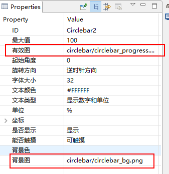
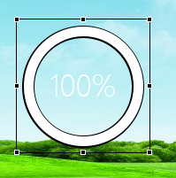

[TOC]

#  API介绍
##  最大值
~~~
void setMax(int max);
int getMax() const { return mMax; }
~~~
## 当前数值
~~~
void setProgress(int progress);
int getProgress() const { return mProgress; }
~~~

# 切图介绍

1. 数值为0时候的背景图
2. 数值为100%时候的图片

# 贴图和代码控制

参考代码：SampleUI-testSlider
## 贴图
将0的图片填入到背景图
将100%的图片填入到有效图

显示效果

## 代码
~~~
mCirclebar2Ptr->setProgress(progress);
~~~

