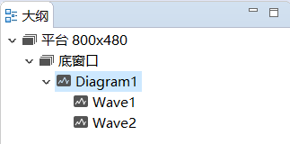
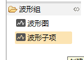
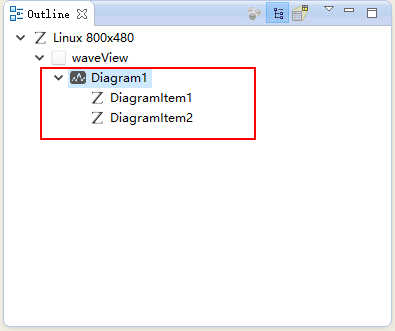
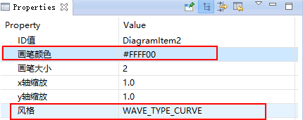
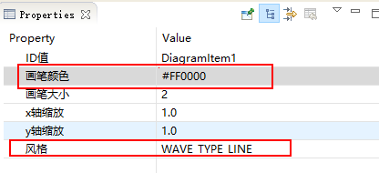
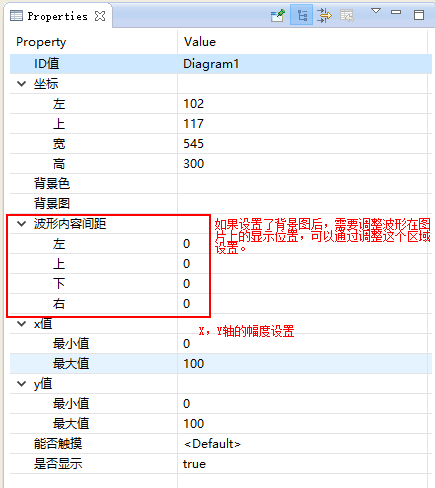
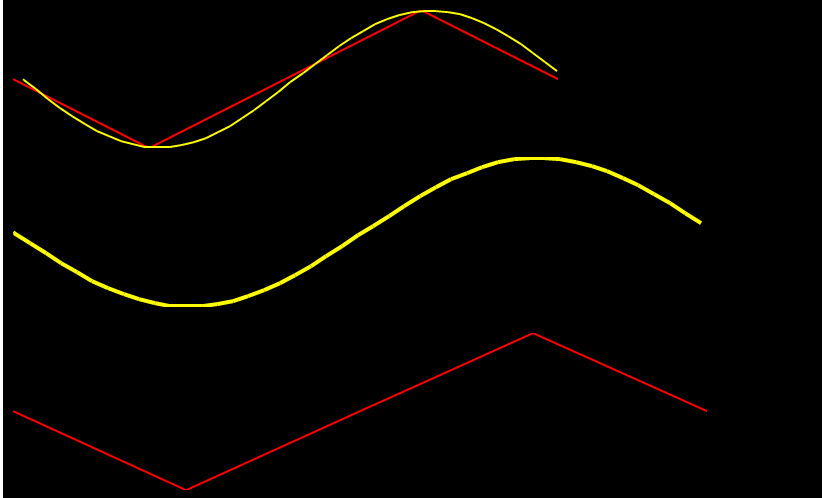

# 波形图
使用该控件可以轻松的绘制曲线型或者折线型波形图。

## 如何使用
  1. 首先在UI文件中创建一个 **波形图** 控件，该控件指定了波形的绘制区域，然后再添加一个 **波形** 控件到刚才创建的区域中，你应该立马就可以看到波形大致的预览效果。具体创建过程如下：   
  
    
  2. 你可以向波形图中添加多个波形， 分别调整它们的样式外观。  
  **注意：由于在预览图上，我们无法直接选中单个波形控件，所以，当我们需要调整指定的波形属性时，需要在大纲视图上进行选择。**
  
    
  
  3. 分别查看 **波形图** 和 **波形** 控件的属性， 可以发现，**波形图** 决定了波形的x轴，y轴的值范围，以及波形的绘制区域。 而 **波形** 决定了每条波形的外观样式。  
  
    
 
   
 
 其中，**波形** 的属性中的 `步进` 和 `刷新间距` 两个属性需要解释下。  
 * 步进  
  表示每次向波形中添加一个数据的时候，波形图像前进的值，该值会受到 **x轴缩放** 属性的影响。
  * 刷新间距  
    表示波形刷新时 **空缺** 的那部分宽度    
         
**以上两个属性只有使用 `void addData(int index, float data)` 函数添加波形数据时才有效。** 

 ## 坐标轴及缩放
 整个波形的图像缩放是自动完成的，我们不需要关心它，我们只需要在属性表中，确定 x轴范围，y轴范围，以及确定整个波形图像的矩形显示区域就可以了。
 注意：波形控件中的 **x轴缩放 、y轴缩放** 属性，它会将你添加的业务数值都乘以该比例后，再绘制到屏幕上，默认为1.0 ，表示不缩放。
 波形的坐标轴由 **x轴最小值、x轴最大值、y轴最小值、y轴最大值** 共同决定。  
 例如，默认的 x 轴范围是 [0, 100], y轴范围是[0,100],则它们构成的坐标轴为   
   
 
 一般情况下，**x轴最小值** 属性输入的值 小于 **x轴最大值** 属性 输入的值。但是如果将最小值，最大值颠倒，那么同样的数据， 绘制的波形图像会左右颠倒，如果使用`void setData(int index, const MPPOINT *pPoints, int count)`函数添加波形数据，那么还会造成刷新方向颠倒。 同理，对于y轴而言，绘制波形图像会造成上下颠倒。 
 
 
  ## 代码操作  
  同样，UI文件只帮助我们快速修改波形的样式外观，具体的波形数据还是得通过代码添加。 
  在项目的`jni/include/control/ZKDiagram.h` 文件public 函数中，可以看到能支持的所有操作。
  * `void setPenWidth(int index, int width)`  
    设置波形线宽度，对应属性表上的 **线条宽度** 属性
  * `void setPenColor(int index, ARGB color)`  
    设置波形颜色，对应属性表上的 **波形颜色** 属性
  * `void setXScale(int index, double xScale)`  
    设置x轴缩放，对应属性表上的 **x轴缩放** 属性， 
  * `void setYScale(int index, double yScale)`  
    设置y轴缩放，对应属性表上的 **y轴缩放** 属性
  * `void setData(int index, const MPPOINT *pPoints, int count)`
  * `void addData(int index, float data)`
  

### 方法

~~~
// index 代表第几条线
void setPenWidth(int index, int width);// 设置画笔宽度
void setPenColor(int index, ARGB color);// 设置画笔颜色
void setXScale(int index, double xScale);// 设置x方向的缩放比例
void setYScale(int index, double yScale);// 设置y方向的缩放比例
void setData(int index, const MPPOINT *pPoints, int count);// 填充数据
~~~

# UI贴图
1. 波形图控件贴图首先区分两种控件：
	* 波形图:这个是波形的的容器，用于在一个波形图上显示多个波形图
	
	* 波形子项：用于将数据绘制成波形图，一个波形图里面允许有多个波形子项，也就是说：一个坐标轴上可以有多个图形的效果。
2. 贴上两个波形，配置不同的颜色和属性
* 选择波形子项的时候通过这个页面下去选择

* 波形2设置为弧形黄色

* 波形1设置为红色，折现显示

* 波形设置的重点属性介绍

* 多贴几张波形，一起看一下效果

# 源码修改
## 定义需要使用的一些变量
~~~
// 波形数据存储区
#define DIAGRAM_SIZE 30
static MPPOINT sPoints[DIAGRAM_SIZE];
static MPPOINT sPoints1[DIAGRAM_SIZE];
//取波形数据里面的偏移值
static int mpointindex = 0;
~~~

## 添加波形移动的方法
~~~
static void movePoints(MPPOINT* p,int size){
	for(int i =0;i < size-1;i++){
		p[i].y = p[i+1].y;
	}
	p[size-1].y = 0;
}
~~~

## 添加定时，用于定时刷新波形数据
~~~
/**
 * 注册定时器
 * 在此数组中添加即可
 */
static S_ACTIVITY_TIMEER REGISTER_ACTIVITY_TIMER_TAB[] = {
		{0,  200}, //定时器id=0,80ms刷新一个波形数据
	//{1,  1000},
};
~~~

## 初始化的时候默认数据
~~~

static void onUI_init(){
    //Tips :添加 UI初始化的显示代码到这里,如:mText1->setText("123");
	// 初始化一下要使用的数据
	for(int i =0;i < DIAGRAM_SIZE;i++){
		sPoints[i].x = (100*i)/DIAGRAM_SIZE;
		sPoints[i].y = 50;
	}
	for(int i =0;i < DIAGRAM_SIZE;i++){
		sPoints1[i].x = (100*i)/DIAGRAM_SIZE;
		sPoints1[i].y = 50;
	}
	// 初始化波形显示内容
	mDiagram1Ptr->setData(0,sPoints,DIAGRAM_SIZE);
	mDiagram1Ptr->setData(1,sPoints1,DIAGRAM_SIZE);
	mDiagram2Ptr->setData(0,sPoints,DIAGRAM_SIZE);
	mDiagram3Ptr->setData(0,sPoints1,DIAGRAM_SIZE);
}

~~~
## 定时器里面更新UI显示
**实际项目可以通过串口数据修改**
~~~
bool bRefresh = true;
static bool onUI_Timer(int id){
    //Tips:添加定时器响应的代码到这里,但是需要在本文件的 REGISTER_ACTIVITY_TIMER_TAB 数组中 注册
    //id 是定时器设置时候的标签,这里不要写耗时的操作，否则影响UI刷新,ruturn:[true] 继续运行定时器;[false] 停止运行当前定时器
	if(id == 0){
		if(!bRefresh){
			return true;
		}
		/** 模拟一个数据
		 *
		 */
		mpointindex++;
		if(mpointindex >= 30){
			mpointindex = 0;
		}
		movePoints(sPoints,DIAGRAM_SIZE);
		movePoints(sPoints1,DIAGRAM_SIZE);
		if(mpointindex%16 == 0){
			sPoints[DIAGRAM_SIZE-1].y = 95;
		}else if(mpointindex%8 == 0){
			sPoints[DIAGRAM_SIZE-1].y = 5;
		}else if(mpointindex%7 == 0){
			sPoints[DIAGRAM_SIZE-1].y = 40;
		}else{
			sPoints[DIAGRAM_SIZE-1].y = 50;
		}
		// 为了方便看到演示效果，我们把波形2的数据和波形1的数据做个相反的数据
		sPoints1[DIAGRAM_SIZE-1].y =100-sPoints[DIAGRAM_SIZE-1].y;

		// 数据和波形图绑定
		mDiagram1Ptr->setData(0,sPoints,DIAGRAM_SIZE);
		mDiagram1Ptr->setData(1,sPoints1,DIAGRAM_SIZE);
		mDiagram2Ptr->setData(0,sPoints,DIAGRAM_SIZE);
		mDiagram3Ptr->setData(0,sPoints1,DIAGRAM_SIZE);
	}
	return true;
}
~~~
## 添加一个按键控制波形是否滚动
~~~
static bool onButtonClick_ButtonOnOff(ZKButton *pButton) {
    //LOGD(" ButtonClick ButtonOnOff !!!\n");
	bRefresh = !bRefresh;
	mButtonOnOffPtr->setSelected(!bRefresh);
    return true;
}
~~~

# 样机效果

# 代码路径
https://gitee.com/zkswe/SampleControls
WaveViewLogic.cc