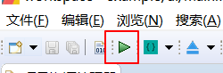

# 如何编译FlyThings项目
编译FlyThings项目十分简单。根据操作方式的不同，如下有三种方式可以编译。  
## 1.  从项目资源管理器选择编译   
具体步骤是： 在项目资源管理器中，左键选中需要编译的项目名，然后右键，在弹出菜单中，选择 **编译FlyThings** 选项即可自动编译该项目。  操作的动画如下：  

   
## 2. 通过工具栏选择编译  
在软件顶部的工具栏上有编译的快捷方式。 同样，先在项目资源管理器中，左键选中需要编译的项目名，然后再工具栏上找到  该绿色三角符号按钮，点击它，即可编译选中的项目。

## 3. 通过快捷键编译
你可能在上面的两个步骤中，已经注意到了编译的快捷键，也就是 **Ctrl + Alt + Z**，强烈推荐使用该方式编译。 在编辑了代码后，直接 **Ctrl + Alt + Z** 快速完成编译，十分方便。


# 如何清理项目
在项目编译过后，通常会留下些编译的目标文件和中间文件。比如 **libs** 和 **obj**文件夹 
，它们的存在是为了加快编译速度，达到增量编译。

  
你可以手动删除它们，或者通过菜单来自动清理。
* 手动删除  
 先选中需要删除的文件夹，右键，在弹出菜单中，选择 **删除** 选项。
 
 
 
* 自动清理  
如果总是手动执行删除，可能会造成误操作，造成重要文件的丢失。所以，利用自动清理，可以有效避免这种情况。
同样是先选中需要操作的项目名，右键，在弹出菜单中，选择 **清空项目** 选项。它会自动删除 **libs** 文件夹和 **obj** 文件夹里的编译中间文件。  
推荐使用此方式来清理文件。

**注意：如果编译时遇到奇怪的问题，或者遇到源码没有编译进程序的问题时，可以尝试先清理项目后，再重新编译。特别是当你导入他人的项目时，这种情况容易频发。**

# 如何重新编译
如果你想完全重新编译代码，那么你可以先清理项目后，再次编译即可


# <span id = "ftu_and_source_relationships">FlyThings编译过程以及UI文件与源代码的对应关系</span>
FlyThings 将UI与代码区分开来，方便管理。 
下文中，UI文件是指项目 **ui** 文件夹下的 所有 **ftu** 文件。
为了减少开发中编写重复代码，我们改进了编译过程。在真正的源码编译之前，工具会根据 UI文件生成相同前缀名的`Logic.cc` 文件，例如`main.ftu`会生成配对的`mainLogic.cc`文件，这里需要注意的是：  
`Logic.cc`文件的生成，并不是直接覆盖，而是增量修改。  
编译时，工具会遍历每个UI文件，读取UI文件中包含的控件。并且为这个控件声明指针变量，在代码中，通过这个指针，就可以操作对应的控件。 指针变量定义在同前缀名的 `Activity.cpp` 文件中。以**main.ftu**为例，就像这样：  

  

**图中可以看到， 所有指针为静态全局变量；并且，你还应该注意到截图中 `#include "logic/mainLogic.cc"` 这条语句，它将 `mainLogic.cc`文件include到`mainActivity.cpp`当中，而我们的业务代码就是写在`mainLogic.cc`文件里，所以，我们可以在`mainLogic.cc`中完全使用这些控件指针。**  
如果你对这些指针的初始化感兴趣，可以在`mainActivity`的`onCreate`方法中找到。


现在，你大概已经知道了UI文件里的控件是如何与这些指针联系起来的。  让我们再来看看`mainLogic.cc`文件里又为我们自动生成了哪些代码。  
如果你的UI文件中没有任何控件，那你的`mainLogic.cc`文件将是这样的:   
```
/**
 * 注册定时器
 * 在此数组中添加即可
 */
static S_ACTIVITY_TIMEER REGISTER_ACTIVITY_TIMER_TAB[] = {
	//{0,  6000}, //定时器id=0, 时间间隔6秒
	//{1,  1000},
};

static void onUI_init(){
    //Tips :添加 UI初始化的显示代码到这里,如:mText1Ptr->setText("123");

}

static void onUI_quit() {
   //Tips :添加UI退出的代码到这里
}


static void onProtocolDataUpdate(const SProtocolData &data) {
    // 串口数据回调接口
}

static bool onUI_Timer(int id){
    //Tips:添加定时器响应的代码到这里,但是需要在本文件的 REGISTER_ACTIVITY_TIMER_TAB 数组中 注册
    //id 是定时器设置时候的标签,这里不要写耗时的操作，否则影响UI刷新,ruturn:[true] 继续运行定时器;[false] 停止运行当前定时器
    return true;
}


static bool onmainActivityTouchEvent(const MotionEvent &ev) {
    // 返回false触摸事件将继续传递到控件上，返回true表示该触摸事件在此被拦截了，不再传递到控件上
    return false;
}
```
待续


