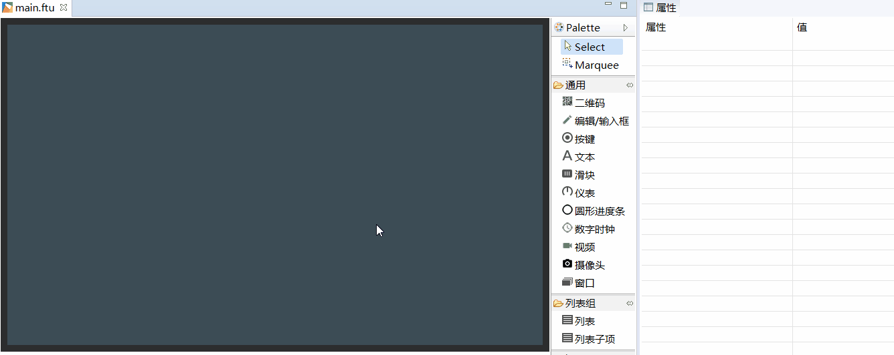
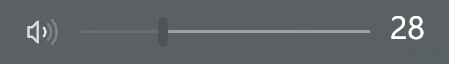

[TOC]


# 文本类 TextView
## 我需要显示一段文字/标签，怎么办？
如果需要显示文字，利用现有的`Textview`件就可以快速实现。具体操作步骤如下：
1. 双击打开main.ftu文件
2. 在右侧控件集合中找到`文本`控件
3. 鼠标左键点击`文本`控件不放，然后将其拖拽到任意位置，松开左键，就能看到自动生成的文本控件。【添加拖拽的gif】


## 如何通过代码动态更新文本内容？
在串口屏的使用中，常常会动态更新文本内容。那么在代码中，我们可以通过`文本`控件对应的指针来动态更新文本控件的内容。具体操作步骤如下：
1. 首先需要知道文本控件在代码中对应的指针变量（[如果你不清楚指针变量名与UI文件中控件ID的对应规则，点击这里]()），这里以ID为`TextView1`的文本控件为例，它对应的指针变量为`mTextView1Ptr`，
2. 如果我们想要将TextView1控件的文本内容修改为`"Hello World"`,可以通过调用文本控件的成员方法`void setText(const char *text)`实现，具体代码为:
```c++
mTextView1Ptr->setText("Hello World");
```
结合实际的使用情况举例。
下面代码的作用是：当ID为Button1的按键被按下时，将ID为TextView1的文本设置为“Hello World”
```c++
static bool onButtonClick_Button1(ZKButton *pButton) {
    mTextView1Ptr->setText("Hello World");
    return false;
}
```


## <span id = "change_color">如何修改文字的颜色？</span>
默认的文本显示为白色，通常无法满足需求，那么可以通过以下两种方式来修改文本颜色。 

### 在属性栏中直接修改控件的颜色

 在项目资源管理器中，选择一个UI文件，双击打开；
 在预览界面上，找到你要修改的控件，左键点击它，在编辑器的右侧就能看到该控件相应的属性表，这时候你就可以根据需要，填写自定义的属性值，就跟操作Excel一样, 找到你需要修改的属性，然后单击修改。

 在文本控件中，可以看到有3个表项与颜色属性有关，分别是
 * 颜色设置 
    - 该属性可以分别设置控件各个状态下文字的颜色值
 * 背景色 
     - 设置控件整个矩形区域的背景颜色（不会根据控件状态的变化而变化）
 * 背景颜色设置  
    - 对背景色属性的扩展，可以分别设置控件各个状态下的背景颜色

  具体示例：

  

  效果图：

  

  上图是属性表颜色部分截图，其表示的含义为：背景颜色设置为黑色， 文字的颜色设置为白色，当控件设置为选中状态时，文字颜色变为红色。

### 通过代码控制颜色变化

   在属性表中设置颜色具有直观、方便的特点，但是缺少灵活性，于是在代码中，通过控件指针，调用相应成员方法可以对颜色进行动态控制。

  以ID为`TextView1`的文本控件为例，以下方法都可以达到修改颜色的目的。 

 * `void setInvalid(BOOL isInvalid)`  
    ```c++
      //将控件TextView1 设置为无效状态；如果属性表中`无效时颜色`属性不为空，则将其设置为指定的颜色，否则无变化。
      mTextView1Ptr->setInvalid(true);
    ```

 * `void setSelected(BOOL isSelected)`     
   ```c++
      //将控件TextView1 设置为选中状态；如果属性表中`选中时颜色`属性不为空，则将其设置为指定的颜色，否则无变化。
       mTextView1->setSelected(true);
   ```
 * `void setPressed(BOOL isPressed)`
   ```c++
      //将控件TextView1 设置为按下状态；如果属性表中`按下时颜色`属性不为空，则将其设置为指定的颜色，否则无变化。
       mTextView1->setPressed(true);
   ```
 * `void setTextColor(int color) //参数color以16进制表示RGB颜色`
   ```c++
      //将控件TextView1 设置为红色。
      mTextView1->setTextColor(0xFF0000);
   ```


# 按键类 Button
## <span id = "add_button">我需要一个按键/按钮， 如何添加，如何修改属性？</span>
如果需要一个按键/按钮，利用现有的`Button`控件就可以快速实现。具体操作步骤如下：
1. 双击打开UI文件
2. 在右侧控件集合中找到`按键`控件
3. 鼠标左键点击`按键`控件不放，然后将其拖拽到任意位置，松开左键，就能看到自动生成的按键控件。
4. 再左键点击刚才生成的按键控件，在编辑器的右侧就能看到该控件的相关属性。在这个属性表格中，你可以像填写Excel表单一样，自由修改属性！

 
## 如何修改按键/按钮的颜色？
参考[如何修改文字的颜色](#change_color)
## <span id = "add_button_style">如何为按钮添加更多的动画效果？</span>
参考[如何用图片来丰富按钮/按键的样式](#add_multi_state_photo_for_button)
## <span id = "add_multi_state_photo_for_button">如何用图片来丰富按钮/按键的样式</span>
默认的按钮控件是纯颜色的，看起来有些枯燥。但是可以添加图片对按钮进行美化。
下面是具体操作步骤：
 1. 首先向UI文件中添加一个按键控件。[如何添加按键控件](#add_button)
 2. 左键选中刚才添加的按键控件，在编辑器的右侧属性栏中可以看到按键的属性表。  
观察发现所有属性当中与图片相关的属性有：
  * 图片设置  
      - 该属性可以分别设置按键各个状态下的图片，便于按键根据状态的变化，自动切换相应图片
  * 图片位置
     - 图片默认是居中且缩放至铺满整个按键矩形区域，你可以任意调整图片的位置及放大、缩小。
  * 背景图
     - 将图片设置为按键的背景，该图片将覆盖按键的整个矩形区域，并且自动缩放。 

具体示例：   


  效果图：  


上图是属性表图片参数部分截图，其表示的含义为：    
  按键默认情况下显示on.png， 按键选中状态时显示off.png；  
  图片位置的 左、上、宽、高四个参数决定了图片的显示区域（以像素为单位），以按键矩形区域的左上角为起点坐标（0，0），向右向下为正方向，终点坐标为（67，31）。 如果图片实际的宽高与指定的宽高参数不相等，则图片会根据指定的宽高进行缩放：

### 理解按键控件的层级关系  
对于一般按键控件，它会绘制四层内容，它们从上到下依次是：
* 按键的文字
* 按键图片
* 按键背景图片
* 按键背景色

## 如何添加图片按键/按钮？
参考[如何为按钮添加更多的动画效果](#add_multi_state_photo_for_button)

## 当按下这个按键/按钮时，在哪儿或如何添加自己的操作代码？
在实际开发中，`按键`是使用频率非常高的一种控件。常常会在按键的点击事件发生后，做一些处理，比如写串口或者刷新UI内容等操作。
要响应按键的点击时间非常的简单。以下是具体步骤：
1. 首先创建一个`按键`控件，将属性ID命名为`Button1`。[如何创建按键控件](#add_button) 


2. 在`项目资源管理器`中，选中当前项目，右键，在弹出菜单中选择`编译FlyThings`选项。这一步的作用是 **根据当前项目内所有的UI文件自动生成模板代码** 。 [了解更多关于代码生成的细节]()
3. 以UI文件为`main.ftu`为例，上一步完成后，将在当前项目文件夹下会生成 `jni/logic/mainLogic.cc`文件， 如下图：

 

  注意： `main.ftu`对应着`mainLogic.cc`，两者的前缀是相同的。[了解更多关于代码生成的细节]()
4. 双击打开`mainLogic.cc` ，在文件的末尾应该会看到如下函数，
```
static bool onButtonClick_Button1(ZKButton *pButton) {
    //LOGD(" ButtonClick Button1 !!!\n");
    return false;
}
```
当在串口屏上点击该`按键`控件后，系统会自动调用该关联函数。所以，如果你需要添加自己的处理代码，直接写在该关联函数里面即可。  

 *  可以看到，函数名称是按一定规则生成。以`按键`控件为例，它函数名称生成规则为
`onButtonClick_XXXX(ZKButton *pButton)`,其中**XXXX**会被替换为控件ID，
所以多个按键控件会生成不同的关联函数。

[了解更多控件的关联函数](relation-function#relation_function)


# 二维码
## 如何添加二维码？
如果需要显示二维码，利用现有的`二维码`控件就可以快速实现。具体操作步骤如下：
1. 双击打开main.ftu文件
2. 在右侧控件集合中找到`二维码`控件
3. 鼠标左键点击`二维码`控件不放，然后将其拖拽到任意位置，松开左键，就能看到自动二维码的控件。
4. 选中刚才生成的二维码控件，在编辑器右侧的属性栏中，可以修改二维码内容，你可以看到二维码图像会同步改变。


# 编辑/输入框
## 我需要数字键盘， 我需要用户手动输入中文，怎么办？
[如何添加编辑/输入框](#add_edit_text)

## <span id = "add_edit_text">如何添加编辑/输入框</span>
如果需要数字及中文输入，利用现有的`编辑/输入框`控件就可以快速实现。具体操作步骤如下：
1. 双击打开main.ftu文件
2. 在右侧控件集合中找到`编辑/输入框`控件
3. 鼠标左键点击`编辑/输入框`控件不放，然后将其拖拽到任意位置，松开左键，就能看到自动编辑/输入框的控件。
4. 当下载运行到机器上，点击`编辑/输入框`控件，会自动打开一个系统内置输入法或者数字键盘，这样就可以输入文字或数字了。
   
5. 默认的`编辑/输入框`为白色，你可以在右侧的属性表里自定义外观样式。其中关于`编辑/输入框`的相关属性有如下几个：
  * **是否为密码框输入**  
    如果选择是，当模拟键盘输入时，正在键入的字符会显示为指定的`密码字符`，否则无变化
  * **密码字符**  
    如果`是否为密码输入`选择`是`,正在键入的字符会显示为指定的`密码字符`，否则无变化
  * **文本类型**  
    该属性有两个选项，分别是  
    * 全文本  
      表示可以输入中英文及数字，不受限制。
    * 仅数字  
      表示只能输入数字，其他受限。
  * **提示文本**  
    当模拟键盘中内容为空时，会自动显示提示文本。
  * **提示文本颜色**  
    当模拟键盘中内容为空时，会自动显示提示文本，该文本颜色为指定的颜色。
### 如何得到模拟键盘的输入内容？
当成功创建了`编辑/输入框`，选择 **编译FlyThings** ，打开工程目录下的`jni/logic/****Logic.cc`文件(\*\*\*\*表示UI文件名 )，找到自动生成的函数  
```
static void onEditTextChanged_XXXX(const std::string &text) {
    //LOGD("当前输入的内容为 %s \n", text.c_str());
}
```
当模拟键盘输入内容的时候，系统会自动调用该函数，参数`text`就是当前模拟键盘上的完整字符串。（`XXXX`表示控件ID名）  
[了解更多控件的关联函数]()

# 滑块/进度条
## 如何使用滑块控件？
很多情况下，我们会用到进度条，例如:  
**调节音量**  
  

利用简单的几张图片，我们也能快速达到这样的效果。  
1. 首先，我们准备四张资源图片  
  * 背景图    
      
  * 有效图  
    
  * 滑块   
     
  * 滑块按下  
    

2. 在编辑器中，创建一个滑块控件  

 
  如果你不了解如何创建控件，[参考创建按键控件](#add_button)
3. 默认的滑块样式是透明的，我们必须为其添加足够的图片资源，它才能正常工作。  
    在属性表中，我们分别设置**有效图 、滑块常显图片、滑块按下时的图片、背景图** 图片 
    
      
4. 上一步完成后，一个滑块的创建基本完成了。如何想在工具中预览滑块滑动的效果，可以修改
 **最大值**属性和**默认进度值**属性。在实时的预览中，你就可以看到滑块游标的位置变化。

## 如何在代码中控制滑块的进度？ 如何获得滑块的当前进度？
如果我们用滑块实现了一个音量条，那肯定需要知道当前音量条的进度值，并且，一旦音量条有变化，我们还必须同步调节音量。  
所有，我们有如下3个函数来解决这些问题。  
1. 进度值变化监听函数  
  如果你在UI文件中创建了滑块控件，那么该函数在 **编译FlyThings** 后，将会自动添加到相应的`XXXXLogic.cc`文件中。  
  当在触摸屏上滑动进度条时、或者进度条当前值有变化时，系统会自动调用该函数。
   ``` 
  static void onProgressChanged_XXXX(ZKSeekBar *pSeekBar, int progress) {
      //LOGD("XXXX滑块的进度值变化为 %d !\n", progress);
}
```
2. `void setProgress(int progress)`  
  用于设置滑块当前进度。 例如：  
  ```  
  //将滑块进度设置为28
  mSeekbarPtr->setProgress(28)
  ```
3. `int getProgress()`  
  用于获得当前滑块的进度值。例如：  
  ```
  int progress = mSeekbarPtr->getProgress();
  LOGD("当前滑块的进度值为 %s", progress);
  ```
     
   
   