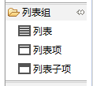
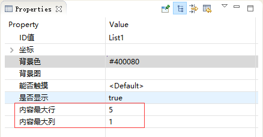
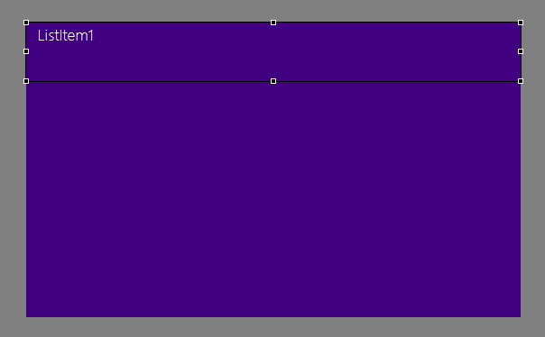
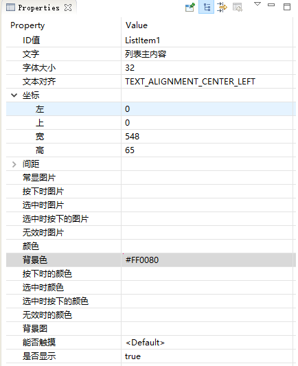
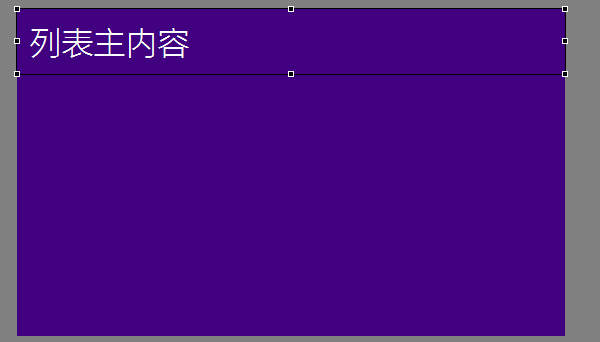
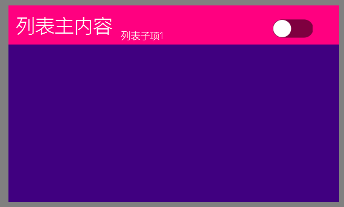
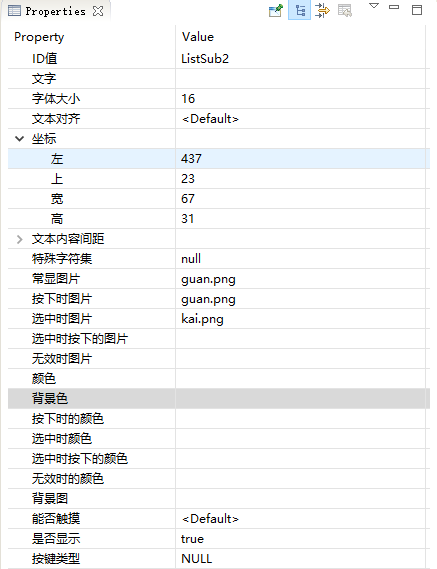
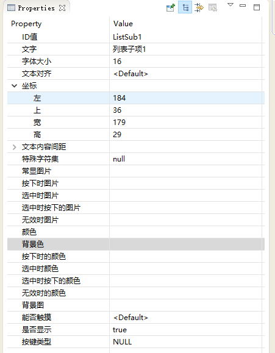

[TOC]

# 控件简介
## 功能
列表按键经常用于一个页面无法展示完成所有信息的时候使用，同时每个单元信息中存在一些一致的属性分类

## 场景
WiFi列表，设备列表，表格信息

# 控件贴图方法
## 控件介绍

列表控件包含三项内容：
1. 列表主控件
2. 列表项：一个列表里面包含的N个列表单元，贴图的时候只需要贴一个即可
3. 列表子项：列表子项需要贴入到列表项目中，每个列表项可以支持5个列表子项的显示，用于实现不同内容的显示和控制部分。

## 贴图方法
1. 先吧列表空间拖入到需要放置的空间上。调整好列表的区域后设置列表区域内的列表内容显示分配：

2. 拖入列表项 到列表区域内的第一个位置

修改一下属性：

3. 加入一个子项显示和一个子项的按钮

	* 按键开关:
	
	* 列表子项目1文字显示：
	

至此可以看到目标列表的一个项目的界面显示效果
点击生成代码

# 控件源码操作
1. 按照之前的方法，设置启动页面 Main.cpp
~~~
const char* onStartupApp(EasyUIContext *pContext) {
	return "tesListActivity";
}
~~~
2. testListLogic.cc中添加测试用的列表数据
~~~

typedef struct{
	const char* mainText;
	const char* subText;
	bool bOn;
}S_TEST_DATA;
static S_TEST_DATA sDataTestTab[]={
		"测试数据1","testsub1",false,
		"测试内容2","testsub2",false,
		"测试数据3","testsub3",false,
		"测试测试4","testsub4",true,
		"测试数据5","testsub5",false,
		"测试数据6","testsub6",true,
		"测试数据7","testsub7",false,
		"测试数据8","testsub8",false,
		"测试数据9","testsub9",false,
		"测试数据10","testsub10",false,
		"测试数据11","testsub11",false
};
~~~
3. 在处理接口代码中添加代码
~~~
// 返回列表数据总长度
static int getListItemCount_List1(const ZKListView *pListView) {
    //LOGD(" getListItemCount_ List1  !!!\n");
	return sizeof(sDataTestTab)/sizeof(S_TEST_DATA);
    //return 0;
}
// 设置对应Index上的UI显示信息
static void obtainListItemData_List1(ZKListView *pListView,ZKListView::ZKListItem *pListItem, int index) {
	ZKListView::ZKListSubItem* psubText = pListItem->findSubItemByID(ID_TESLIST_ListSub1);
	ZKListView::ZKListSubItem* psubButton = pListItem->findSubItemByID(ID_TESLIST_ListSub2);
	psubText->setText(sDataTestTab[index].subText);
	pListItem->setText(sDataTestTab[index].mainText);
	psubButton->setSelected(sDataTestTab[index].bOn);
    //LOGD(" obtainListItemData_ List1  !!!\n");
}

// 点击列表的时候修改切换开关的状态。
static void onListItemClick_List1(ZKListView *pListView, int index, int id) {
    //LOGD(" onListItemClick_ List1  !!!\n");
	sDataTestTab[index].bOn = !sDataTestTab[index].bOn;
}
~~~

# Sample代码下载
代码跟滑动进度条做到了一起：不同的项目请切换一些启动页面。
https://gitee.com/zkswe/testSlider
