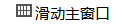

# 控件ID名与指针变量名的命名规则

指针变量名由三部分构成。
分别为固定的小写 **m** 作为前缀 + **ID**名 + **Ptr** 作为结尾  
以ID为 **Textview1** 的控件为例  

 
 
编译后，生成的对应的指针变量名为  **`mTextview1Ptr`**  

  

指针变量的类型根据控件类型而定。 各个控件对应指针类型如下：   
各个类的头文件都可在项目 **jni/include** 文件夹下找到。

| 控件名 | 类名 
|:--------:|:-------:
|    | ZKQRCode  | 
|    | ZKEditText   |
|    | ZKButton    |
|     | ZKTextView   |
|    | ZKSeekBar   | 
|    | ZKPointer   | 
|    | ZKCircleBar   | 
|    | ZKDigitalClock   | 
|    | ZKVideoView   | 
|    | ZKCameraView   | 
|  | ZKWindow |
|  | ZKListView |
|   | ZKSlideWindow |
|   | ZKDiagram |

