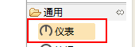
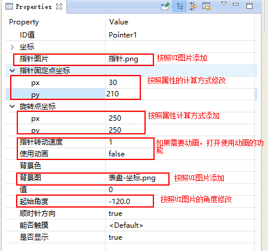
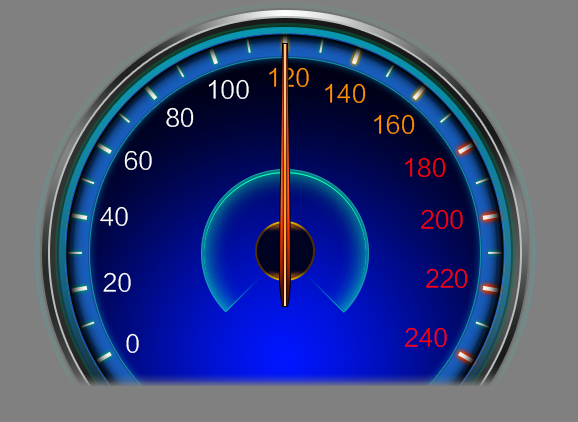
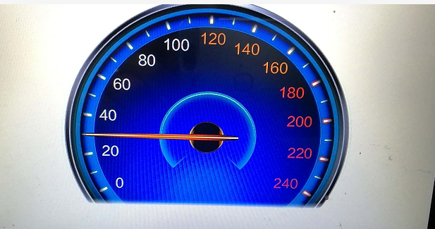

[TOC]

# 控件简介
## 功能介绍
指针仪表控件主要使用到需要将一个图形旋转的场景下。
### 属性
1.起始角度
2.顺（逆）时钟方向
3.是否开启旋转动画
4.旋转速度
5.旋转点坐标

6.固定点坐标

事例：

以上效果属性配置为：
起始角度：-120（垂直向上方向为0度），顺时钟方向，固定点坐标（30，210），旋转点坐标（250，250），代码设置旋转角度60：pPointer->setTargetAngle(60);
## 应用场景
仪表盘
旋转进度图像

# UI贴图
1. 使用 仪表的控件拖放到空白区域
 
2. 按照介绍上面的计算方法设置属性

3. 生成代码

# 代码编辑
1. 在Main.cpp 里面设置默认启动的应用
~~~
const char* onStartupApp(EasyUIContext *pContext) {
	return "testpointerActivity";
}
~~~
2. 用定时器来查看动态旋转的功能，开启定时器和设置角度
~~~
/**
 * 注册定时器
 * 在此数组中添加即可
 */
static S_ACTIVITY_TIMEER REGISTER_ACTIVITY_TIMER_TAB[] = {
	{0,  500}, //定时器id=0, 时间间隔6秒
	//{1,  1000},
};
static int currentAng = 0;
static bool onUI_Timer(int id){
    //Tips:添加定时器响应的代码到这里,但是需要在本文件的 REGISTER_ACTIVITY_TIMER_TAB 数组中 注册
    //id 是定时器设置时候的标签,这里不要写耗时的操作，否则影响UI刷新,ruturn:[true] 继续运行定时器;[false] 停止运行当前定时器
	if(id == 0){
		currentAng += 10;
		if(currentAng > 240) currentAng = 0;
		mPointer1Ptr->setTargetAngle(currentAng);
	}
	return true;
}
~~~

# 机器上运行效果

# 代码地址
* 为了方便后续的讲解。所有的工程都会放入到Samle_Controls的项目中。
https://gitee.com/zkswe/SampleControls