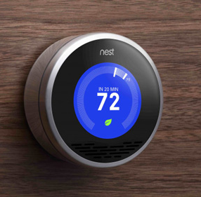

[TOC]
# 关于我们
### 目标
	让开发更加简单，高效；让普通用户拥有更便易的客制化开发方案。
### 价值
	专业：用专业的技术铸造专业的产品
	创新：不断的开拓创新为客户提供源源不断的价值
	责任：用技术改变生活

# 关于显示屏模组
## 我们为什么做Linux的显示解决方案
目前随着技术的发展，人机交互方案一直在升级。而目前在一些传统领域人机交互发展相对比较缓慢。传统领域里面有不少基于单片机，单片机+FPGA的显示解决方案为不少客户解决了彩屏显示交互开发困难的问题；但是随着用户需求和交互内容的增多，传统的硬件限制已经无法满足大部分的客户需求，所以我们做了这个产品。赋能传统领域便捷的人机交互体验方案+物联网的接入能力，助力物联网的发展。
## 产品优势

* **对比传统的单片机串口屏或者单片机+FPGA显示屏的解决方案**
1. 提供了类手机，平板电脑一样的最新交互体验方式，客户接受程度高，产品使用学习成本低，显示效果好的优势
2. 通过软件实现了多图层虚拟的技术，解决传统显示方案限制图层数目的问题
3. 支持png 格式的解码能力，让图片图层叠加效果更佳
4. 从系统层支持WiFi，以太网，2G，4G的接入能力为客户更加便捷的接入网络；同时方便快速的接入深智云，微信物联，微信支付，支付宝支付等平台，可以为共享行业提供快速的物联终端解决方案。
5. 提供视频解码的能力，更方便的向用户展示信息。
* **对比Android和传统的Linux解决方案**
1. 提供测试稳定的硬件基础，节省了硬件开发的测试验证的周期
2. 提供针对物联+显示的系统开发工作，节省系统在物联和显示上再次开发和调试系统的时间
3. 提供低成本高效率的运行能力：目前系统运行于 1G单核的CPU,64MBDDR2,16MB的Flash上，节省50%以上的硬件成本
4. 提供组态+用户逻辑源码的开发工具，方便客户快速完成客制化的开发；开发周期至少比传统的方式节省60%以上。
5. 深度定制的系统具备了3秒快速启动和24小时*365天安全运行的能力。

# 应用场景
* 智能家居：

* 智能家电

* 共享行业

* 电梯指示牌

* 广告机

* 充电桩

* 评价机

* 只要您有需要显示，可能我们就能帮助您

# [FlyThings 系统框架说明](system_introdoction#system_introdoction)
