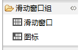
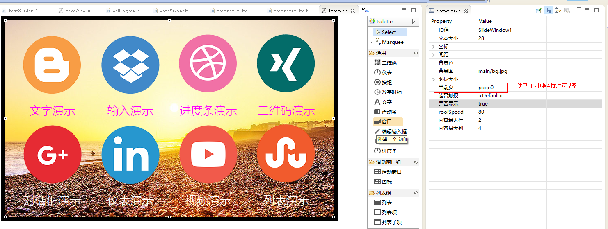

[TOC]

# UI 简介
滑动窗口的功能常用于主页ICON一页不能摆放完整的情况下使用。
目前的GUI支持规则的局部滑动页面布局。无需任何代码干预即可完成。
## 贴图控件
* 滑动窗口 ： 窗口容器
* 图标： 窗口内滑动的元素

# UI贴图方法
1. 新建一个UI页面。
2. 拖入一个滑动窗口，修改一下配置

3. 按照从左到右，从上到下的规则添加图标
	* 生成顺序的按照贴图顺序完成
	* 
4. 当贴图完成一页的时候，需要选择第一页开始贴图

第二页图片

5. 生成代码
# 代码编辑
当我们不需要切换页面的时候需要编辑页面代码。
1. 在Main.cpp 里面添加启动的界面。
~~~
const char* onStartupApp(EasyUIContext *pContext) {
	return "mainActivity";
}
~~~

2. 添加相应的代码：
~~~
// index 就是点击页面的图标偏移值，从0开始
static void onSlideItemClick_SlideWindow1(ZKSlideWindow *pSlideWindow, int index) {
    //LOGD(" onSlideItemClick_ SlideWindow1 %d !!!\n", index);
}
~~~

3. 通过代码切换上下页
~~~
// 切换到下一页
mSlideWindow1Ptr->turnToNextPage();
// 切换到上一页
mSlideWindow1Ptr->turnToPrevPage();

// 可通过UI工具设置“翻页动画”是否开启，默认关闭
~~~
