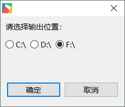
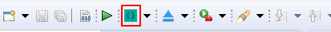

# 从SD卡启动程序
当我们不能使用ADB下载程序时，还可以将程序下载到SD卡里，从SD卡来启动程序。  

## 操作具体步骤  
首先我们要配置程序的输出目录。
1. 找到工具栏上的这个按钮  
     

2. 点击旁边的黑色下拉箭头，在弹出的菜单中选择 **路径配置**    

   

3. 在弹出框中，选择SD卡的盘符(请确保SD卡能正常使用），点击确定 。
  
    
 
4. 在上面的步骤中，我们配置好了输出目录，现在点击下图中的按钮开始编译，它会将编译结果  打包输出到配置的盘符下。  

   

5. 操作成功后， 将在配置的盘符下 生成 **EasyUI.cfg 、ui、lib、 font** 等目录和文件。  
6. 将SD卡拔出，插入机器中，将机器重新上电，这时候，系统检测到SD卡里的文件，就会启动卡里的程序，而不是系统内的程序。