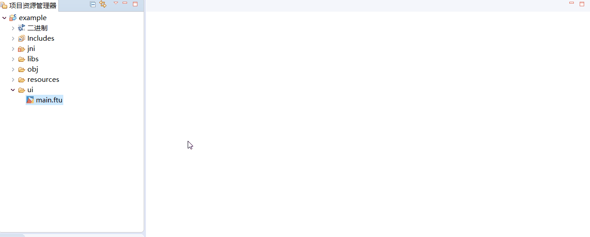
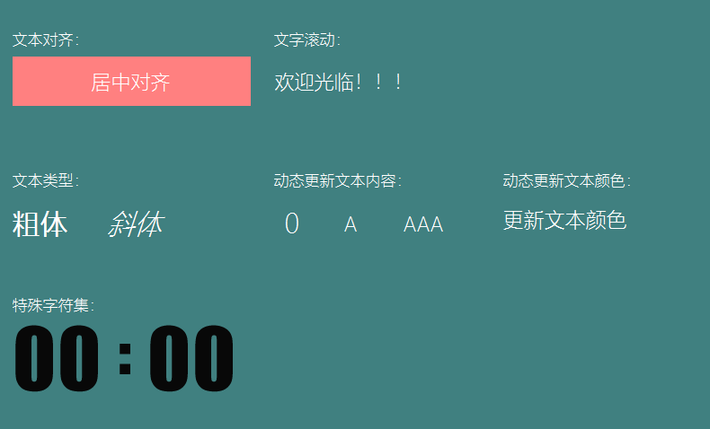

# 文本类 TextView
## <span id="add_textview">我需要显示一段文字/标签，怎么办？</span>
如果需要显示文字，利用现有的`Textview`件就可以快速实现。具体操作步骤如下：
1. 双击打开main.ftu文件
2. 在右侧控件集合中找到`文本`控件
3. 鼠标左键点击`文本`控件不放，然后将其拖拽到任意位置，松开左键，就能看到自动生成的文本控件。  

 


## 如何通过代码动态更新文本内容？
在串口屏的使用中，常常会动态更新文本内容。那么在代码中，我们可以通过`文本`控件对应的指针来动态更新文本控件的内容。具体操作步骤如下：
1. 首先需要知道文本控件在代码中对应的指针变量（[如果你不清楚指针变量名与UI文件中控件ID的对应规则，点击这里](named_rule)），这里以ID为`TextView1`的文本控件为例，它对应的指针变量为`mTextView1Ptr`，
2. 如果我们想要将TextView1控件的文本内容修改为`"Hello World"`,可以通过调用文本控件的成员方法`void setText(const char *text)`实现，具体代码为:
```c++
mTextView1Ptr->setText("Hello World");
```
结合实际的使用情况举例。
下面代码的作用是：当ID为Button1的按键被按下时，将ID为TextView1的文本设置为“Hello World”
```c++
static bool onButtonClick_Button1(ZKButton *pButton) {
    mTextView1Ptr->setText("Hello World");
    return false;
}
```


## <span id = "change_color">如何修改文字的颜色？</span>
默认的文本显示为白色，通常无法满足需求，那么可以通过以下两种方式来修改文本颜色。 

### 在属性栏中直接修改控件的颜色

 在项目资源管理器中，选择一个UI文件，双击打开；
 在预览界面上，找到你要修改的控件，左键点击它，在编辑器的右侧就能看到该控件相应的属性表，这时候你就可以根据需要，填写自定义的属性值，就跟操作Excel一样, 找到你需要修改的属性，然后单击修改。

 在文本控件中，可以看到有3个表项与颜色属性有关，分别是
 * 颜色设置 
    - 该属性可以分别设置控件各个状态下文字的颜色值
 * 背景色 
     - 设置控件整个矩形区域的背景颜色（不会根据控件状态的变化而变化）
 * 背景颜色设置  
    - 对背景色属性的扩展，可以分别设置控件各个状态下的背景颜色

 具体示例：  
 
   

 效果图：

   

  上图是属性表颜色部分截图，其表示的含义为：背景颜色设置为黑色， 文字的颜色设置为白色，当控件设置为选中状态时，文字颜色变为红色。

### 通过代码控制颜色变化

   在属性表中设置颜色具有直观、方便的特点，但是缺少灵活性，于是在代码中，通过控件指针，调用相应成员方法可以对颜色进行动态控制。

  以ID为`TextView1`的文本控件为例，以下方法都可以达到修改颜色的目的。 

 * `void setInvalid(BOOL isInvalid)`  
    ```c++
      //将控件TextView1 设置为无效状态；如果属性表中`无效时颜色`属性不为空，则将其设置为指定的颜色，否则无变化。
      mTextView1Ptr->setInvalid(true);
    ```

 * `void setSelected(BOOL isSelected)`     
   ```c++
      //将控件TextView1 设置为选中状态；如果属性表中`选中时颜色`属性不为空，则将其设置为指定的颜色，否则无变化。
       mTextView1->setSelected(true);
   ```
 * `void setPressed(BOOL isPressed)`
   ```c++
      //将控件TextView1 设置为按下状态；如果属性表中`按下时颜色`属性不为空，则将其设置为指定的颜色，否则无变化。
       mTextView1->setPressed(true);
   ```
 * `void setTextColor(int color) //参数color以16进制表示RGB颜色`
   ```c++
      //将控件TextView1 设置为红色。
      mTextView1->setTextColor(0xFF0000);
   ```

### 样例代码
由于文本控件属性较多，更多属性效果参考[样例代码](https://github.com/zkswe/Z11SDemoCode/archive/master.zip)。   
预览效果图： 


