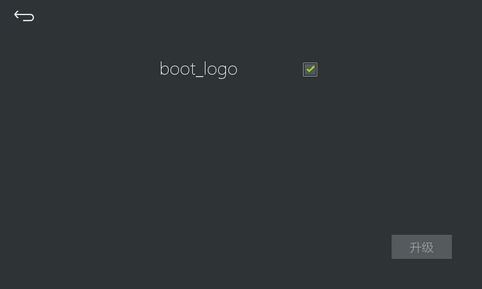

# 升级开机LOGO
1. 首先准备一张开机LOGO图片，图片必须满足以下条件：  
> 图片名称固定为 `boot_logo.JPG`，注意，文件后缀是大写的 **JPG**； 其他名称将无法识别。  
> 图片大小不能超过 **128**KB。  
> 图片分辨率必须与屏幕分辨率完全相同。
2.  将 `boot_logo.JPG` 拷贝到SD卡根目录下
3.  将SD卡插入到机器中，然后设备会自动弹出升级提示。选择`boot_logo` 然后点击升级即可。
4.  升级完成后系统会关机重启。此时拔出sdcard。防止系统再次升级。 

    