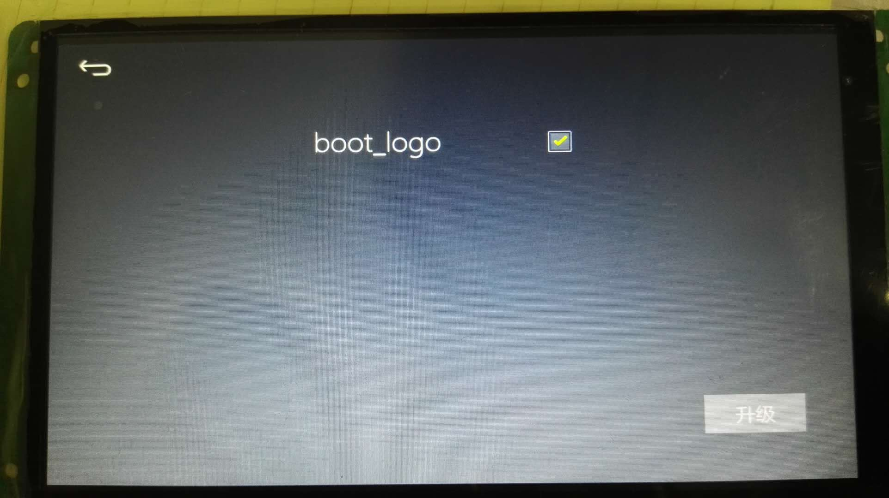

1.  将开机LOGO的图片（**与目标板屏幕分辨率匹配的JPG图片**）名称修改为 `boot_logo.JPG`（**注意：文件后缀是大写的JPG**）
2.  将 `boot_logo.JPG` 拷贝到SD卡根目录下
3.  将SD卡插入到机器中，然后设备会自动弹出升级提示。选择`boot_logo` 然后点击升级即可。
4.  升级完成后系统会关机重启。此时拔出sdcard。防止系统再次升级

