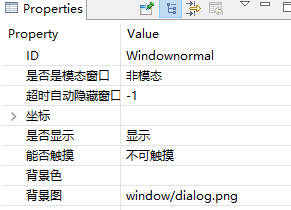

[TOC]

# 概要描述
窗口实际是一个容器部件。可以包含所有的控件，也可以再次包含一个新的窗口。可以用于以下场景
* 显示隐藏一个控件组合
* 当需要完成tab页面的时候可以通过多个窗口实现不同的窗口切换
* 弹出的对话框
* 弹出悬浮框

# 参考样例
SampleUI-window

# API
## 显示窗口
~~~
void showWnd();
~~~
## 隐藏窗口
~~~
void hideWnd();
~~~
## 判断窗口是否显示
~~~
bool isWndShow() const;
~~~

# 贴图方法
## 属性配置
### 模态对话框【独占窗口，点击窗口以外自动隐藏】

将属性设置为模态
如果需要超时不操作的情况下自动隐藏的话则设置隐藏时间。这里配置为8s自动隐藏
窗口内可以添加任何组建

### 非模态窗口
#### 属性配置

#### 代码操作
~~~
f(mWindownormalPtr->isWndShow()){
    mWindownormalPtr->hideWnd();
    pButton->setText("显示窗口");
}else{
    mWindownormalPtr->showWnd();
    pButton->setText("隐藏窗口");
}
~~~
