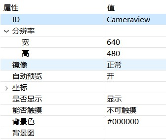

# 摄像头
FlyThings提供了摄像头的控件。  

> 摄像头功能并非所有版本的机器都支持！如果需要正常使用该功能，那么请购买支持USB摄像头功能的机器版本。 

# 如何使用  
1. 首先，创建一个 **摄像头** 控件，默认背景色为黑色。
2. 查看 **摄像头** 的属性表  

     

我们自动预览设置为`开`的状态。

## 样例代码
在该样例中， 实现了摄像头的预览及拍照功能、相册功能。   
具体实现，参考[样例代码](demo_download#demo_download)  

 