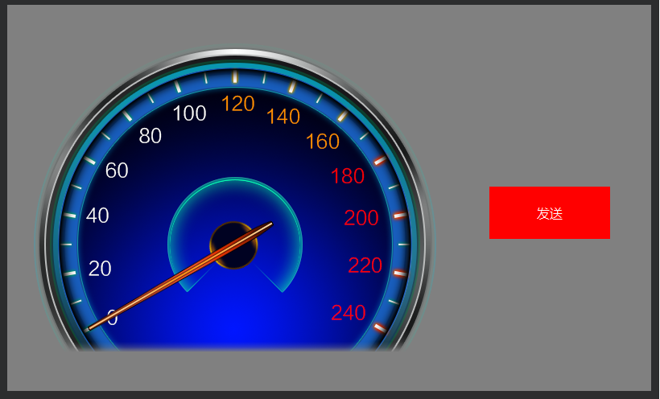

# 数据块通讯实战

通过前面章节[数据块协议讲解](serial_datablock_introdoction),我们来总结一下数据块串口通讯的要点：

1. 数据块定义
2. 接收数据
3. 发送数据

## 案例

以前面的通讯协议为例，实现一个简单的通讯程序。

效果：按下按键发送指令，串口接收指令控制显示屏的仪表指针旋转，UI效果图如下：



### 实现步骤：

#### 1.定义数据块
在jni/uart/ProtocolData.h中定义数据块：
(1). 设置数据块最大长度
(2). 定义数据块内容

```c++
#define DATA_LEN 256	// 数据块的最大长度，不要超过2K

// 数据块定义(用户有效数据)
#pragma pack(push,1)
typedef struct {
	// 用户自定义数据
	uint8_t    angle;		// 仪表指针角度
} SProtocolData;
#pragma pack(pop)
```

#### 2.界面接收到协议数据的回调接口，见jni/logic/mainLogic.cc:
(1).设置仪表指针偏转角度
```c++
static void onProtocolDataUpdate(const SProtocolData &data) {
	// 串口数据回调接口

	// 设置仪表指针旋转角度
	mPointer1Ptr->setTargetAngle(data.angle);
}
```

协议数据如下所示：
```c++
   帧头     数据长度    角度值
0xFF 0x55  0x00 0x01   angle
```

#### 3.串口数据的发送：
在按键的关联函数中实现按下按键发送角度数据：

```c++
static bool onButtonClick_Button1(ZKButton *pButton) {
    //LOGD(" ButtonClick Button1 !!!\n");
	SProtocolData data;
	data.angle = 20;
	sendProtocol((BYTE *)&data, sizeof(data));
}
```

到此，串口演示程序就介绍完了，我们可以通过短接屏上通讯串口的TX和RX，实现自发自收，或者使用串口助手观察实验现象。
