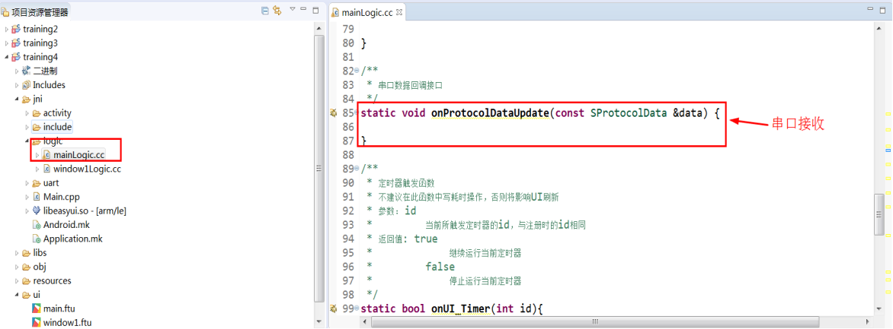

# 数据块协议讲解

这一章节重点讲解数据块格式的串口通信使用，方便用户在入门时快速掌握显示屏模组与MCU（或其他设备）的串口通信。


## 通讯协议格式

通讯协议格式如下所示：

| 帧头（2字节） | 数据长度（2字节） | 数据块（N字节） |
|:---------------:|:-----------------:|:---------------:|
|     0xFF55      |        len        |      data       |

**注意：数据长度len是指数据块的长度，由于数据块定义是一个结构体，所以无需人为计算其长度，用户主要关注数据块的定义与使用即可。**

### 1.CommDef.h文件中定义了同步帧头信息及最小数据包大小信息：

```c++
// 需要打印协议数据时，打开以下宏
#define DEBUG_PRO_DATA


/* SynchFrame DataLen Data  */
/*     2Byte 	2Byte  N Byte   */
// 无CheckSum情况下最小长度: 2 + 2 = 4


#define DATA_PACKAGE_MIN_LEN		4

// 同步帧头
#define CMD_HEAD1	0xFF
#define CMD_HEAD2	0x55
```

### 2.ProtocolData.h文件用于设置数据块内容：
**注意：串口数据块的定义必须保证与MCU端（或其它设备）定义一致。**

```c++
#define DATA_LEN 256	// 数组块的最大长度，不要超过2K

// 数据块定义(用户有效数据)
#pragma pack(push,1)
typedef struct {
	// 用户自定义数据
	uint8_t    angle;		// 仪表指针角度
} SProtocolData;
#pragma pack(pop)
```

### 3.串口数据接收——当串口数据更新时，logic.cc文件的页面程序会通过 onProtocolDataUpdate串口回调接口函数收到数据(如下图所示)：



每一个UI界面文件对应的逻辑代码文件xxxLogic.cc文件都有一个串口回调接口用于接收串口数据。

```c++
/**
 * 串口数据回调接口
 */
static void onProtocolDataUpdate(const SProtocolData &data) {

}
```

### 4.串口数据发送
当应用需要发送数据给MCU（或其他设备）时直接调用sendProtocol函数即可。

```c++
bool sendProtocol(const BYTE *pData, int len);
```

其中pData是我们在ProtocolData.h中定义的结构体
len的长度是该结构体的长度，可以使用sizeof函数获取。

#### 使用方法：
例：按下按键Button1发送angle值为20.

```c++
static bool onButtonClick_Button1(ZKButton *pButton) {
    //LOGD(" ButtonClick Button1 !!!\n");
	SProtocolData data;
	data.angle = 20;
	sendProtocol((BYTE *)&data, sizeof(data));
}
```
