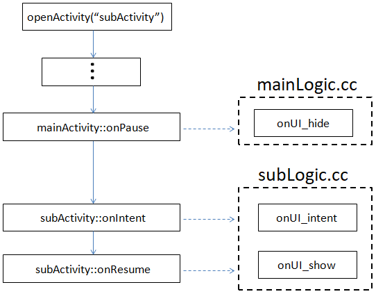
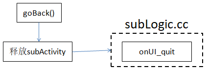

# Interface activity cycle
Before introducing the activity cycle of the interface, let's first understand the hierarchical relationship of the interface


First of all, after our application is started, we will first enter the interface corresponding to **mainActivity** which is the startup interface, and then open the interface corresponding to **subActivity**  through the `openActivity` method, and then enter the interface corresponding to **thirdActivity**, It forms the hierarchical effect seen in the figure above;The interface opened later is at the upper level of the hierarchy, and a relationship of **Stack** is formed between them;

## Activity flow when opening the interface
Let's take a look at the process of the program after calling the `openActivity` method. Here are two situations:
* **Does not exist** the interface to be opened in the interface stack;


Let’s first take a look at **subLogic.cc** in `onUI_init` function，Only when the interface does not exist in the interface stack, this function will be used when it is opened for the first time. Going here means that all control pointers are initialized. In this function, we can start to perform some operations on them. as follows：
```c++
static void onUI_init() {
	//Tips :Add the display code of UI initialization here, such as:mTextView1Ptr->setText("123");
	LOGD("sub onUI_init\n");
	mTextView1Ptr->setText("123");
}
```

When the interface is opened, data is passed over and received and processed in the， `onUI_intent` callback function:
```c++
static void onUI_intent(const Intent *intentPtr) {
	LOGD("sub onUI_intent\n");
	// Judge not empty
	if (intentPtr) {
		// Key value analysis
		std::string cmd = intentPtr->getExtra("cmd");		// "open"
		std::string value = intentPtr->getExtra("value");	// "ok"
		......
	}
}
```
Interface display completion callback `onUI_show` function;

* **There is** the interface to be opened in the interface stack;


In this case, only the corresponding interface in the interface stack is moved to the top level, and the ~~`onUI_init`~~ process is not followed;


<br/><br/>
Open to display an interface, which means that the previous top-level interface is hidden; assuming that
The **mainActivity** interface opens the **subActivity** interface, and their activity flow is as follows:



Here we focus on the **mainActivity** interface **hide** ------> **subActivity** interface **display** process;

## Activity flow when closing the interface
When we call the `goBack()` function, the top-level interface will pop up until the interface is started;


When the interface is closed, the `onUI_quit` function will be called back. If some resources are requested after the interface is opened, remember to release it here;



After exiting the top-level interface, the next-level interface will be displayed, that is, the  `onUI_show` interface of the next-level interface will be called back; <br/><br/>
When we call the `goHome()` function, we will directly go back to the startup interface and pop up all other interfaces;


When we call the `closeActivity("xxx")` function, we can remove any interface except the startup interface; when the interface is not the top-level interface, the next-level interface will not go~~`onUI_show`~~;