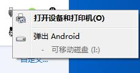
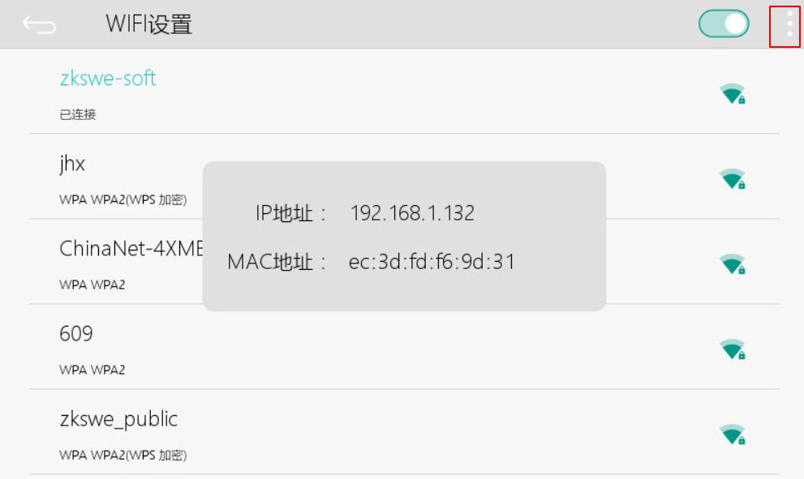

# ADB fast download and debug
FlyThings can quickly download programs to the machine via USB cable or WIFI. Specific steps are as follows:   
## First, make sure that the computer and the machine are successfully connected. There are two ways to connect:
> [!Note]
> ##### Note: If you buy a version with WIFI function, you can only connect via WIFI, and the USB cable cannot be used;
> ##### The Ethernet version prefers to use the USB cable connection. If the USB connection is unsuccessful, the WIFI connection (ie network connection) is used. If the connection fails, please contact us.
> ##### Similarly, if you buy a version without WIFI function, you can only connect via USB cable.
> ##### You can see if the USB cable is connected successfully

 1. Use a USB cable to connect the computer and the machine. If the computer can recognize the machine as an Android device, the connection is normal. If you can't connect normally, the computer prompts a driver problem, you can try [Download Update Driver](install_adb_driver.md)。
 2. Connect via WIFI. (This method requires the machine to support WIFI function.)  
   First enter the [WIFI setting interface](wifi.md) of the machine, and connect the machine to the same network as the computer, that is, the computer and the machine must be connected to the same WIFI. (If a different network will cause the subsequent download procedure to fail). After the network connection is successful, click the menu button in the upper right corner of the WIFI setting interface to view the IP address of the machine, then open the FlyThings IDE development tool, and on the menu bar, select the menu **Debug Configuration** -> **ADB IP Configuration**, Fill in the machine IP and select OK. The tool will try to connect with the machine. If it prompts that the connection is successful, it means normal. If the prompt fails, you need to check whether the IP is correct? Is the machine connected to WIFI normal?     

     WIFI setting interface  

      

    Operation process animation  

      

## Download and debug  
After completing the previous step, you can download the program directly. In the Project Explorer, select the project name, right-click, and select the  **Download and Debug** menu in the pop-up menu. After selection, it will automatically compile once. After the compilation is successful, download the program to the machine. If an error is prompted, then you can see that the machine program has been updated.
Similarly, after selecting the item, you can also use the shortcut keys **Ctrl + Alt + R** to download and debug.

[**View print log**](logcat.md)

# Precautions  
* If an Android phone is connected to the computer, it may conflict with the machine and cause the download to fail. When using it, it is recommended to disconnect the Android phone temporarily.
    * **Note ： Run the program in this way, and the program cannot be solidified into the machine. If you unplug the TF card or restart after a power failure, the program will automatically resume. If you want the firmware to be stored in the device, you can select [make upgrade image](make_image.md) and then upgrade.**

## Use ADB on the command line
We can quickly view the status and log of the device through ADB commands.  
First select an item arbitrarily, then find the menu bar at the top, and select **Debug Configuration** -> **Open System Command Line**, Now we can enter the command we want to execute in the pop-up command line. Then press Enter to execute the command.  
Here are some commonly used commands. 
### adb logcat -v time