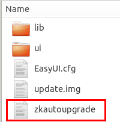

# 插卡自动升级
在屏幕损坏或触摸不准情况下，想要对系统进行升级，我们可以在TF卡根目录下创建一个文件
**zkautoupgrade** （注意：该文件是没有后缀名的）  

这样机器插卡后会自动勾选上升级项，默认2s后开始升级；如果需要控制其他时间后才开始升级，我们可以打开`zkautoupgrade`文件填相应的数字即可，单位为秒；升级完成后，系统重启，记得要拔出TF卡，防止再次自动升级。