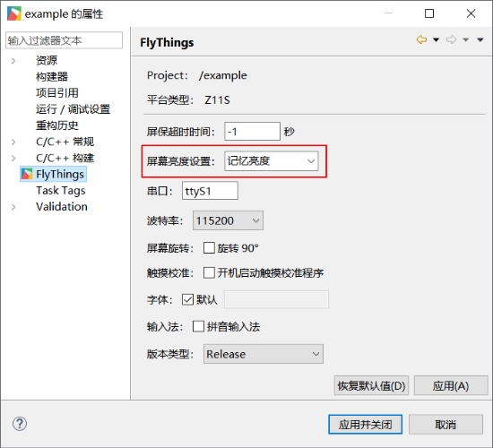

# 屏幕背光操作
* 所需头文件  
  ```c++
  #include "utils/BrightnessHelper.h"
  ```
  
## 亮度调节
* 调节背光亮度  
  亮度范围是 **0 ~ 100**   (注意：0并不等于关屏)  
     
  ```c++
  //将屏幕亮度调整为80
  BRIGHTNESSHELPER->setBrightness(80);
  ```
* 获取当前亮度值
  ```c++
  BRIGHTNESSHELPER->getBrightness();
  ```
  
## 开关屏幕背光

* 关屏
    ```c++
    BRIGHTNESSHELPER->screenOff();
    ```
* 开屏
    ```c++
    BRIGHTNESSHELPER->screenOn();
    ```

## 记忆亮度
系统开机起来默认是记忆最后调节的亮度值，如果想要修改为不记忆亮度或设置固定的亮度值，可以打开工程的属性进行修改：  

  