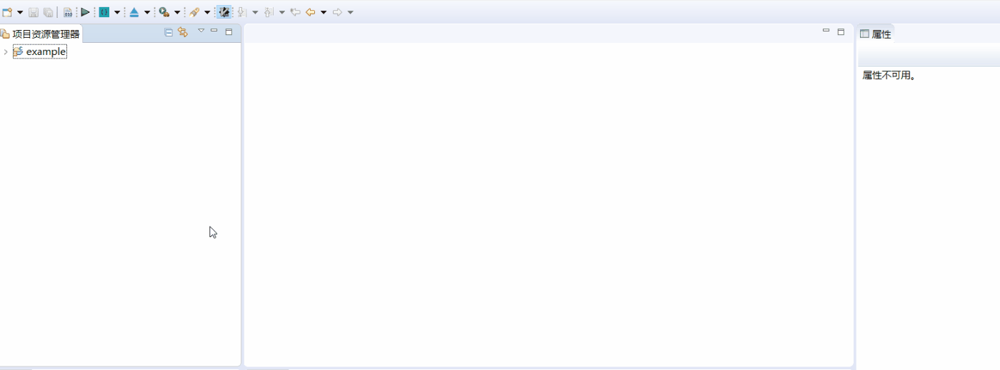
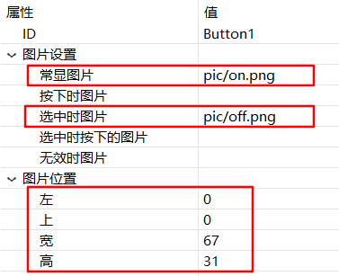
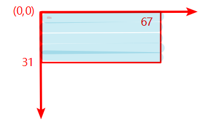
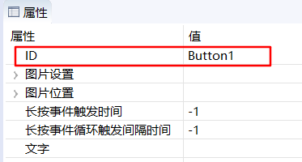
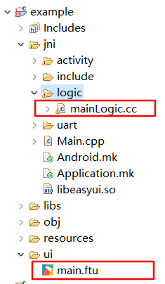
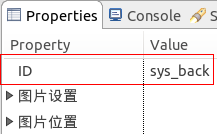
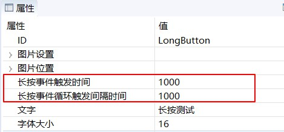
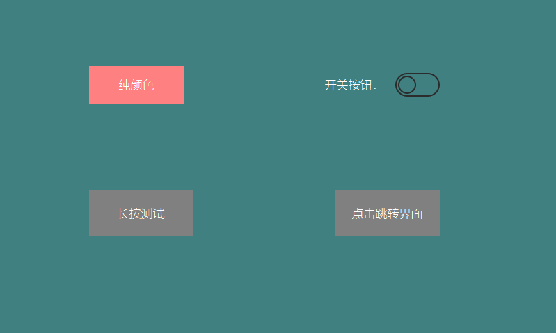

# 按键类 Button
## <span id = "add_button">我需要一个按键/按钮， 如何添加修改属性？</span>
如果需要一个按键/按钮，利用现有的`Button`控件就可以快速实现。具体操作步骤如下：
1. 双击打开UI文件
2. 在右侧控件集合中找到`按键`控件
3. 鼠标左键点击`按键`控件不放，然后将其拖拽到任意位置，松开左键，就能看到自动生成的按键控件。
4. 再左键点击刚才生成的按键控件，在编辑器的右侧就能看到该控件的相关属性。在这个属性表格中，你可以像填写Excel表单一样，自由修改属性！

   
## 如何修改按键/按钮的颜色？
参考[如何修改文字的颜色](textview.md#change_color)
## <span id = "add_button_style">如何为按钮添加更多的动画效果？</span>
参考[如何用图片来丰富按钮/按键的样式](#add_multi_state_photo_for_button)
## <span id = "add_multi_state_photo_for_button">如何用图片来丰富按钮/按键的样式</span>
默认的按钮控件是纯颜色的，看起来有些枯燥。但是可以添加图片对按钮进行美化。
下面是具体操作步骤：
 1. 首先向UI文件中添加一个按键控件。[如何添加按键控件](#add_button)
 2. 左键选中刚才添加的按键控件，在编辑器的右侧属性栏中可以看到按键的属性表。  
观察发现所有属性当中与图片相关的属性有：
  * 图片设置  
      - 该属性可以分别设置按键各个状态下的图片，便于按键根据状态的变化，自动切换相应图片
  * 图片位置
     - 图片默认是居中且缩放至铺满整个按键矩形区域，你可以任意调整图片的位置及放大、缩小。
  * 背景图
     - 将图片设置为按键的背景，该图片将覆盖按键的整个矩形区域，并且自动缩放。

具体示例：   



  效果图：  


上图是属性表图片参数部分截图，其表示的含义为：    
  按键默认情况下显示on.png， 按键选中状态时显示off.png；  
  图片位置的 左、上、宽、高四个参数决定了图片的显示区域（以像素为单位），以按键矩形区域的左上角为起点坐标（0，0），向右向下为正方向，终点坐标为（67，31）。 如果图片实际的宽高与指定的宽高参数不相等，则图片会根据指定的宽高进行缩放：  

  

### 理解按键控件的层级关系  
对于一般按键控件，它会绘制四层内容，它们从上到下依次是：
* 按键的文字
* 按键图片
* 按键背景图片
* 按键背景色

## 如何添加图片按键/按钮？
参考[如何为按钮添加更多的动画效果](#add_multi_state_photo_for_button)

## 当按下这个按键/按钮时，在哪儿或如何添加自己的操作代码？
在实际开发中，`按键`是使用频率非常高的一种控件。常常会在按键的点击事件发生后，做一些处理，比如写串口或者刷新UI内容等操作。
要响应按键的点击时间非常的简单。以下是具体步骤：
1. 首先创建一个`按键`控件，将属性ID命名为`Button1`。[如何创建按键控件](#add_button)

   
2. 在`项目资源管理器`中，选中当前项目，右键，在弹出菜单中选择`编译FlyThings`选项。这一步的作用是 **根据当前项目内所有的UI文件自动生成模板代码** 。 [了解更多关于代码生成的细节](ftu_and_source_relationships.md#ftu_and_source_relationships)
3. 以UI文件为`main.ftu`为例，上一步完成后，将在当前项目文件夹下会生成 `jni/logic/mainLogic.cc`文件， 如下图：

    <br/>
  注意： `main.ftu`对应着`mainLogic.cc`，两者的前缀是相同的。[了解更多关于代码生成的细节](ftu_and_source_relationships.md#ftu_and_source_relationships)
4. 双击打开`mainLogic.cc` ，在文件的末尾应该会看到如下函数，
```c++
static bool onButtonClick_Button1(ZKButton *pButton) {
	//LOGD(" ButtonClick Button1 !!!\n");
	return false;
}
```
当在串口屏上点击该`按键`控件后，系统会自动调用该关联函数。所以，如果你需要添加自己的处理代码，直接写在该关联函数里面即可。  

 *  可以看到，函数名称是按一定规则生成。以`按键`控件为例，它函数名称生成规则为
`onButtonClick_XXXX(ZKButton *pButton)`,其中**XXXX**会被替换为控件ID，
所以多个按键控件会生成不同的关联函数。

[了解更多控件的关联函数](relation_function.md#relation_function)

## 系统按键
除了自己定义的ID值外，按键还保留了两个系统按键值：`sys_back` 和 `sys_home` ，从名字上我们大致可以知道它们的功能：**返回键** 和 **Home键** ；点击返回键，界面会回到上一界面，如果进入了多层级的界面，点击Home键可以直接回到主界面（启动界面）。我们只需在按键的属性框中把ID值设置为 `sys_back` 或 `sys_home` ，就可以实现相应的功能。



[了解更多界面交互](open_close_app#close_app.md)

## 如何处理按键长按事件  
如果需要处理按键的长按事件，需要手动添加长按事件的监听。  具体步骤如下：  
1. 在按键的 **属性表** 中， 设置 **长按事件触发时间** 、**长按事件循环触发间隔时间** 两个属性  ；下图中，我分别将其设置为 1000、1000， 单位是毫秒。

   

2. 设置属性后, 编译, 打开对应的 Logic.cc 文件;  在文件顶部, 声明`class LongClickListener`, 并继承`ZKBase::ILongClickListener`类 ,实现 `virtual void onLongClick(ZKBase *pBase)` 方法。

    ```c++
    namespace { // 加个匿名作用域，防止多个源文件定义相同类名，运行时冲突

    //实现长按监听接口
    class LongClickListener : public ZKBase::ILongClickListener {

             virtual void onLongClick(ZKBase *pBase) {  
                    LOGD("触发长按事件");
                    static int count = 0;

                    char buf[128] = {0};
                    snprintf(buf, sizeof(buf), "长按事件触发次数 %d", ++count);
                    //每次触发长按事件，修改按键的文字
                    mLongButtonPtr->setText(buf);
             }
    };

    }
    ```
3. 接着，实例化上一步定义的监听类，声明为静态类型  

    ```c++
    static LongClickListener longButtonClickListener;
    ```

4. 在 `static void onUI_init()` 函数中注册按键长按监听  

    ```c++
    static void onUI_init(){

            //注册按键长按监听
            mLongButtonPtr->setLongClickListener(&longButtonClickListener);
    }
    ```
5. 在`static void onUI_quit()`函数中取消按键长按监听

    ```c++
    static void onUI_quit() {
           //取消按键长按监听
           mLongButtonPtr->setLongClickListener(NULL);
    }
    ```
6. 添加完代码后，编译，将程序下载到机器中，长按测试；可以看到 按键的文字被修改，`onLongClick`函数成功响应。
具体实现，可以参考[样例代码](demo_download.md#demo_download)

## 如何处理按键触摸事件  
如果需要在按键**按下**或**抬起**的时候做出响应，那么可以通过注册触摸的监听接口来实现。  具体步骤如下：  
1. 实现自己的触摸监听接口：
    ```c++
    namespace {	// 加个匿名作用域，防止多个源文件定义相同类名，运行时冲突

    // 实现触摸监听接口
    class TouchListener : public ZKBase::ITouchListener {
    public:
        virtual void onTouchEvent(ZKBase *pBase, const MotionEvent &ev) {
            switch (ev.mActionStatus) {
            case MotionEvent::E_ACTION_DOWN:
                mTouchButtonPtr->setText("按下");
                break;
            case MotionEvent::E_ACTION_UP:
                mTouchButtonPtr->setText("抬起");
                break;
            default:
                break;
            }
        }
    };

    }
    ```
2. 接着，实例化上一步定义的监听类，声明为静态类型  

    ```c++
    static TouchListener sTouchListener;
    ```

4. 在 `static void onUI_init()` 函数中注册按键触摸监听  

    ```c++
    static void onUI_init() {
        //注册按键触摸监听
        mTouchButtonPtr->setTouchListener(&sTouchListener);
    }
    ```
5. 在`static void onUI_quit()`函数中取消按键触摸监听

    ```c++
    static void onUI_quit() {
        //取消按键触摸监听
        mTouchButtonPtr->setTouchListener(NULL);
    }
    ```
6. 添加完代码后，编译，将程序下载到机器中，点击触摸测试；可以看到 按键的文字被修改。
具体实现，可以参考[样例代码](demo_download.md#demo_download)  

## 样例代码  

由于按键控件属性较多，更多属性效果请参考[样例代码](demo_download.md#demo_download)中的ButtonDemo工程。   
样例预览效果图：  


