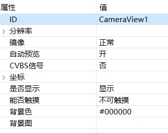

# 摄像头
FlyThings提供了摄像头的控件。  

> [!Note]
>  摄像头功能并非所有版本的机器都支持！如果需要正常使用该功能，那么请购买支持USB摄像头功能的版本。 

## 如何使用  
1. 首先，创建一个 **摄像头** 控件，默认背景色为黑色。
2. 查看 **摄像头** 的属性表  

     

  将自动预览设置为**开**  
  根据所接摄像头的型号，选择**CVBS**信号与否
3. 将摄像头与屏连接，再下载运行程序，即可看到摄像头的预览画面。

## 开始/停止预览
我们可以通过代码控制 开始/停止预览画面
* 开始预览
```c++
mCameraView1Ptr->startPreview();
```
* 停止预览
```c++
mCameraView1Ptr->stopPreview();
```

## 摄像头拍照

1. 实现拍照回调接口
  ```c++
  class PictureCallback : public ZKCamera::IPictureCallback {
  public:
      virtual void onPictureTakenStarted() {
        mTextView1Ptr->setText("拍照开始");
      }
      virtual void onPictureTakenEnd() {
        mTextView1Ptr->setText("拍照结束");
      }
      virtual void onPictureTakenError() {
        mTextView1Ptr->setText("拍照错误");
      }
      virtual const char* onPictureSavePath() {
          //照片保存路径
          return "/mnt/extsd/camera.jpg";
      }
  };
  ```

2. 实例化接口，并注册 
  ```c++
  //定义为全局静态变量
  static PictureCallback picture_callback;
  ```

3. 注册拍照回调接口
  ```c++
  static void onUI_init(){
      mCameraView1Ptr->setPictureCallback(&picture_callback);
  }
  ```
  ```c++
  static void onUI_quit() {
    //记得在界面退出时将注册接口置空
      mCameraView1Ptr->setPictureCallback(NULL);
  }
  ```
4. 增加一个按键，当点击按键时，请求拍照
  ```c++
  static bool onButtonClick_Button3(ZKButton *pButton) {
	  //请求拍照
	  mCameraView1Ptr->takePicture();
      return false;
  }
  ```

## 样例代码
在该样例中， 实现了摄像头的预览及拍照功能、相册功能。   
具体实现，参考[样例代码](demo_download.md#demo_download) CameraDemo项目

 