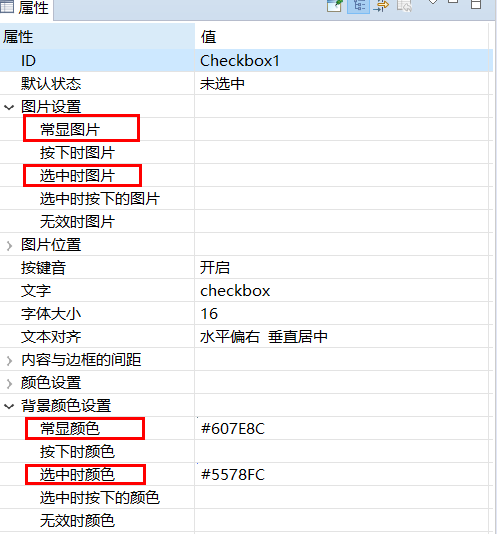
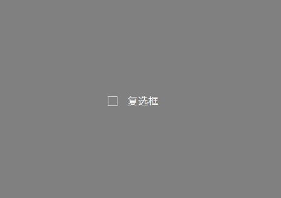
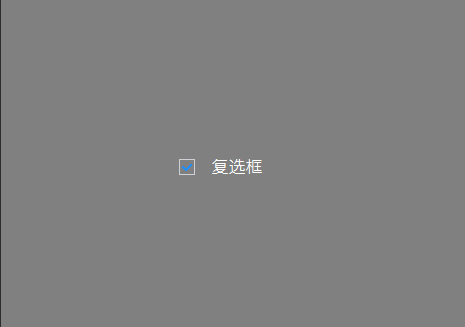

# 复选框 CheckBox
复选框 是基于 按键 的一个控件。 如果你需要一个开关按钮，或一个复选按钮，用复选框控件更合适，也更简单易用。  
当点击该控件时，它会自动切换为选中状态，再点击一次又切换为非选中状态，切换状态的同时，也会根据属性中设置的图片、颜色等自动切换。
## 如何使用
1. 双击打开UI文件
2. 在右侧控件集合中找到`复选框`控件
3. 鼠标左键点击`复选框`控件不放，然后将其拖拽到任意位置，松开左键，就能看到自动生成的复选框控件。
4. 再左键点击刚才生成的复选框控件，在编辑器的右侧就能看到该控件的相关属性。    
  根据需要，设置各个状态的图片、各个状态的颜色。 这里重点注意 **选中时的图片及颜色**。  
  
    
  如果你设置了图片，发现图片大小显示异常，可以在 **图片位置** 属性中，调整图片的位置及大小。  
  通常情况下，我们将图片调整到矩形区域的左边，文字放到矩形区域的右边。
5. 属性设置完成后再编译，对应的`Logic.cc` 中会生成它的关联函数。  
   当你点击该控件时，关联函数会被系统调用， 其中参数 `bool isChecked` 表示选中状态。     
  ```c++
  static void onCheckedChanged_Checkbox1(ZKCheckBox* pCheckBox, bool isChecked) {
    if (isChecked) {
      //复选框 为 选中状态
      LOGD("选中");
    } else {
      //复选框 为  未选中状态
      LOGD("未选中");
    } 
  }
  ```
 
6. 下载调试，查看效果。
 

## 样例代码  

请参考[样例代码](demo_download.md#demo_download)中的CheckBoxDemo工程。   
样例预览效果图：  


