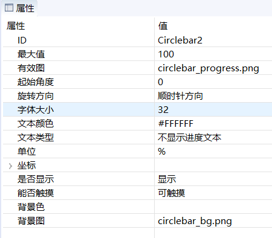
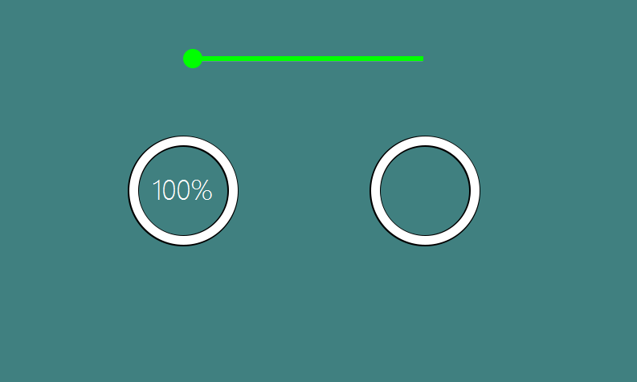

#  Circular progress bar
In some cases, we need to display a Loading animation. Then the circular progress bar is very suitable.

## How to use    
1. First, open the UI file, create a **Circular Entry Ba**, and then set the  **Valid Image** property. A basic circular progress bar is created.  
   All its properties are as follows:

   

2. The circular progress bar essentially displays the fan-shaped area corresponding to the current progress. This area is a crop of the **effective image**. For example:   
If the properties are set according to the above figure, the maximum value is 100, the starting angle is 0, and the rotation direction is clockwise, then when we set the progress of 25, only the 90° fan-shaped area in the upper right corner is displayed. If the progress value is 100, then all valid graphs are displayed.  
> Note: The display area of this sector is only cropped for the **effective image**, the  **background image** will not be cropped.

   

## Code operation
The operation function provided by the circular progress bar is very simple.    
```
//Set the current progress
void setProgress(int progress);
//Get the current progress value
int getProgress()；

//Set the maximum progress
void setMax(int max);
//Get the maximum progress
int getMax()；
```


# Sample code
In the example, if you slide the upper slider, the progress of the two circular progress bars at the bottom will change accordingly.  
For the specific use of the circular progress bar control, refer to the CircleBarDemo project in [Sample Code](demo_download.md#demo_download) 

  
