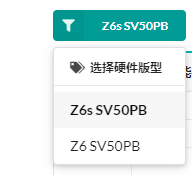
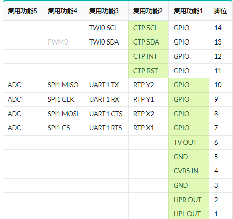
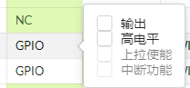

      
## Core Module
  The core module needs to generate its own mirror image and flash the machine before using the various functions of the module.

## Tutorial
1. Register and log in to the website [https://superv.flythings.cn](https://superv.flythings.cn/)

2. Select the hardware version   
   
3. Select the function of each pin
 
     
   
   
   
   > **Note**：Capacitive touch PIN:CTPSCL、CTPSDA、CTPINT、CTPRST
esistive touch PIN：RTPY2、RTPY1、RTPX2、RTPX1
4. Select the screen resolution; if necessary, adjust the screen parameters again

   
5. Select touch type

   
   > **Note**： The touch type should correspond to the PIN pin. Capacitive touch PIN：CTPSCL、CTPSDA、CTPINT、CTPRST
Resistive touch PIN：RTPY2、RTPY1、RTPX2、RTPX1

6. After all the above settings are completed, click Submit, and the new system image will be downloaded according to the configuration.

  
7. After the new image is downloaded, refer to the [How to make a flashing card](https://docs.flythings.cn/zh-hans/sd_boot), to flash the device.

8. After successfully flashing, you can view [FlyThings Development Document](https://docs.flythings.cn/) vfor application development.

