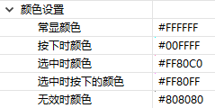

# General attributes
Before starting to introduce each control, let's have a basic understanding of some common properties and setting interfaces of the control;

## <span id = "widgetID">Control ID value</span>
The ID value is the unique identifier of the control. The control ID value in each ftu file is not allowed to have the same name. The control ID value in different ftu files is allowed to have the same name; after setting the ID value, it will be compiled in **activity** The corresponding macro definition is generated in the corresponding header file in the directory:


Get the ID value of the control:
```c++
/**
 * This interface is defined in the control base class ZKBase
 * Header file location: include/control/ZKBase.h
 *
 * Note: The following interfaces are defined in the ZKBase class unless otherwise specified
 * All controls directly or indirectly inherit the ZKBase class, so all controls can call the public interface in the ZKBase class
 */
int getID() const;

/* Operation example: Click the button control to print the ID value of the control */
static bool onButtonClick_Button1(ZKButton *pButton) {
    int id = pButton->getID();
    LOGD("onButtonClick_Button1 id %d\n", id);
    return false;
}
```

## Control position
We open any ftu file, select any control, in the property box, we can see the attribute **coordinates**, which determines the display position of the control:


Where **the coordinate value of the upper left corner** is relative to the position of the upper left corner of the parent control;<br/>
Set and get the position of the control through code:
```c++
/* Interface Description */
// set location
void setPosition(const LayoutPosition &position);
//Get location
const LayoutPosition& getPosition();


/* Operation example */
// Click the button control to set the button position
static bool onButtonClick_Button1(ZKButton *pButton) {
    // Left: 0, Top: 0, Width: 100, Height: 200
    LayoutPosition pos(0, 0, 100, 200);
    pButton->setPosition(pos);
    return false;
}

// Click the button control to get the button position
static bool onButtonClick_Button2(ZKButton *pButton) {
    // The mLeft, mTop, mWidth, and mHeight variables of pos correspond to the coordinate values respectively
    LayoutPosition pos = pButton->getPosition();
    return false;
}
```

## Background color


This is relatively simple, you can see the effect by modifying the color;<br/>
Code to set the background color:
```c++
/* When color is -1, the background is set to transparent; other color values are 0xRGB, and the color value does not support alpha */
void setBackgroundColor(int color);


/* 操Operation example: Click the button control and set the background color to red */
static bool onButtonClick_Button1(ZKButton *pButton) {
    pButton->setBackgroundColor(0xFF0000);
    return false;
}
```

## Background image


After selecting the picture,
you can see the effect   

Here we focus on explaining how to set the background image through code:
```c++
/**
 * The pPicPath parameter can have the following two ways:
 * 1. Absolute path, such as: "/mnt/extsd/pic/bg.png"
 * 2. Relative resource directory path, just put the picture in the resources directory of the project, after compiling and packaging, you can use it, if there is a bg.png picture in the resources directory, just set "bg.png".
 */
void setBackgroundPic(const char *pPicPath);


/* Operation example */
mButton1Ptr->setBackgroundPic("/mnt/extsd/pic/bg.png"); // set absolute path
mButton1Ptr->setBackgroundPic("bg.png");    // Set the bg.png picture in the resources directory
```

## Show and hide


Through this property, we can set the default display or hidden state of the control; double-click the control in the outline view to quickly modify the state:


In addition, we can also dynamically set the control display and hide through code:
```c++
void setVisible(BOOL isVisible);
BOOL isVisible() const;

/* Operation example */
mButton1Ptr->setVisible(TRUE);  // Display button control
mButton1Ptr->setVisible(FALSE); // hide button control


/**
 * Window controls can also use the following interfaces, with the same functions
 * Header file location: include/window/ZKWindow.h
 */
void showWnd();  // show window
void hideWnd();  // hide the window
bool isWndShow() const;  // Whether the window is displayed

/* Operation example */
mWindow1Ptr->showWnd();
mWindow1Ptr->hideWnd();
```

## Control state
For **Text**、**Button**、**list item** , they have 5 states, here we need to explain: normal display state, pressed state, selected state, selected pressed state, invalid state After setting, it will affect the background color, text color and display picture of the corresponding state of the control;





The pressed state does not need to be set by code, the touch control is the pressed state;<br/>
Code operation interface of selected state and invalid state:
```c++
// Set the selected state
void setSelected(BOOL isSelected);
BOOL isSelected() const;

/* Operation example */
mButton1Ptr->setSelected(TRUE);
mButton1Ptr->setSelected(FALSE);


/**
 * Invalid state function description: when the control is set to the invalid state, the touch control has no effect, that is, it does not respond to the press and lift event
 */
// Set invalid state
void setInvalid(BOOL isInvalid);
BOOL isInvalid() const;

/* Operation example */
mButton1Ptr->setInvalid(TRUE);
mButton1Ptr->setInvalid(FALSE);
```

## Sample description

We use the following small examples to understand the simple usage of related interface functions of common attributes.

### 1.Create controls

First, we create a new Flythings project, double-click to open the main.ftu file under the project UI folder, and drag the button control and text control in the control bar.


### 2.Compile the project
(If you are not sure about the specific operation, please see [《How to compile the FlyThings project》](how_to_compile_flythings.md#how_to_compile_flythings)chapter)


### 3.Call control property function
After the compilation is complete, open the       jni/logic/mainLogic.cc file in the project and you can see that the `onButtonClick_Button1` function is generated at the bottom of the file.
**We will call the getID() function in this function to get the ID value of the button control Button1, and call the setText() function to display it in the text control TextView1.**
([If you are not sure about the corresponding rules of the pointer variable name and the control ID in the UI file, click here](named_rule.md))


### 4.Download and debug
In the project manager, select the project name, right-click, and select **Download and Debug**  in the pop-up menu to temporarily download the program to the screen and run it. After running, click the button to see the [ID value of button control Button1](#widgetID) is 20001.

### Note:


<font color="#E6161E" size="4">If you want to learn more about the setting interface functions of the common attributes of the control, you can open the /jni/include/control/ZKBase.h file, and the main attribute setting interface functions have been commented.</font>

