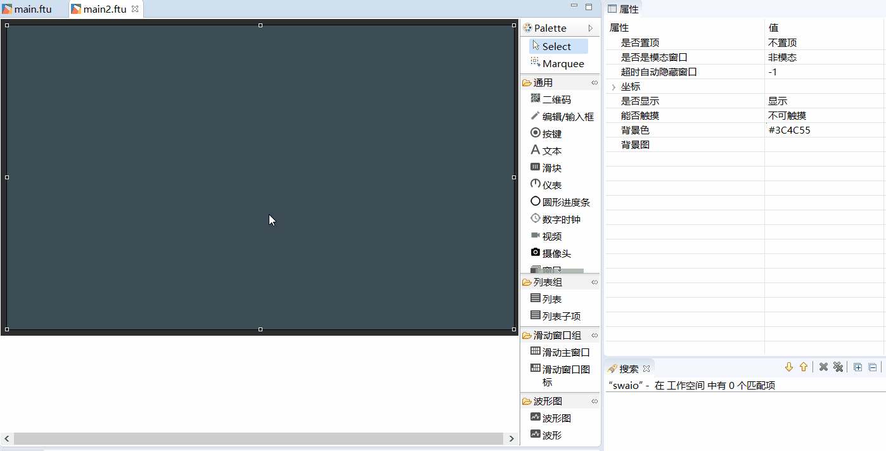
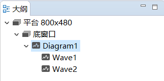
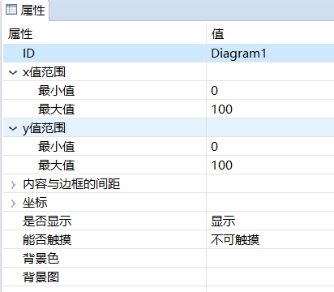
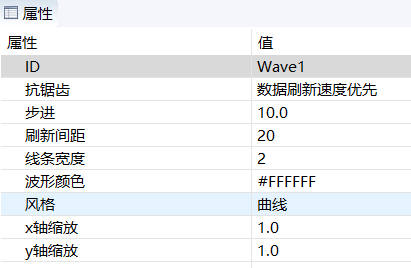
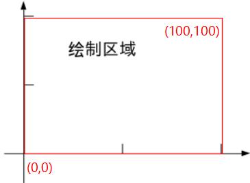
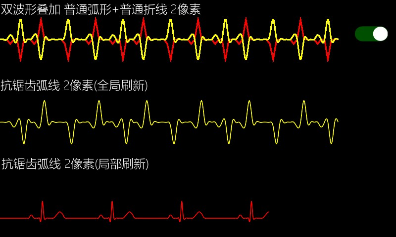

# 波形图
使用该控件可以轻松的绘制曲线型或者折线型波形图。

## 如何使用
  1. 首先在UI文件中创建一个 **波形图** 控件，该控件指定了波形的绘制区域，然后再添加一个 **波形** 控件到刚才创建的区域中，你应该立马就可以看到波形大致的预览效果。具体创建过程如下：  
  
       
  2. 你可以向波形图中添加多个波形， 分别调整它们的样式外观。  
  **注意：由于在预览图上，我们无法直接选中单个波形控件，所以，当我们需要调整指定的波形属性时，需要在大纲视图上进行选择。**
  
       
  
  3. 分别查看 **波形图** 和 **波形** 控件的属性， 可以发现，**波形图** 决定了波形的x轴，y轴的值范围，以及波形的绘制区域。 而 **波形** 决定了每条波形的外观样式。  
  
        
 
       
 
 其中，**波形** 的属性中的 `步进` 和 `刷新间距` 两个属性需要解释下。  
 * <span id = "step_property"> **步进** </span>  
  表示每次向波形中添加一个数据的时候，波形图像前进的值，该值会受到 **x轴缩放** 属性的影响。
  * **刷新间距**  
    表示波形刷新时 **空缺** 的那部分宽度    
         
**以上两个属性只有使用 `void addData(int index, float data)` 函数添加波形数据时才有效。** 


## 坐标轴及缩放
 
 整个波形的图像缩放是自动完成的，我们不需要关心它，我们只需要在属性表中，确定 x轴范围，y轴范围，以及确定整个波形图像的矩形显示区域就可以了。
 注意：波形控件中的 **x轴缩放 、y轴缩放** 属性，它会将你添加的业务数值都乘以该比例后，再绘制到屏幕上，默认为1.0 ，表示不缩放。
 波形的坐标轴由 **x轴最小值、x轴最大值、y轴最小值、y轴最大值** 共同决定。  
 例如，默认的 x 轴范围是 [0, 100], y轴范围是[0,100],则它们构成的坐标轴为   
 
   
 
 一般情况下，**x轴最小值** 属性输入的值 小于 **x轴最大值** 属性 输入的值。但是如果将输入的最小值，最大值颠倒，那么同样的数据， 绘制的波形图像会左右颠倒;  
 如果使用`void setData(int index, const MPPOINT *pPoints, int count)`函数添加波形数据，那么还会造成刷新方向颠倒。 同理，对于y轴而言，绘制波形图像会造成上下颠倒。   
 
## 代码操作  
  同样，UI文件只帮助我们快速修改波形的样式外观，具体的波形数据还是得通过代码添加。 
  在项目的`jni/include/control/ZKDiagram.h` 文件public 函数中，可以看到能支持的所有操作。  
  **注意：与其他控件不同，我们添加的 `波形` 控件，虽然有ID属性，但是它并不生成独立的指针变量， 只有包含`波形` 的 `波形图`控件才会生成指针变量。所以对某个波形的操作，需要通过 `波形图` 指针，再借助 `index`值来表明对哪一个 `波形` 操作。
`index`的值从 0 开始。**
  * `void setPenWidth(int index, int width)`  
    设置波形线宽度，对应属性表上的 **线条宽度** 属性
  * `void setPenColor(int index, ARGB color)`  
    设置波形颜色，对应属性表上的 **波形颜色** 属性
  * `void setXScale(int index, double xScale)`  
    设置x轴缩放，对应属性表上的 **x轴缩放** 属性， 
  * `void setYScale(int index, double yScale)`  
    设置y轴缩放，对应属性表上的 **y轴缩放** 属性
  * `void setData(int index, const MPPOINT *pPoints, int count)`  
    ```
    typedef struct _MPPOINT
    {
        float x;
        float y;
    }MPPOINT;
    ```
    `MMPOINT`结构体包含了 单个数据的 x、y值。
    函数表示将`pPoints`数组中的`count`个点绘制到 第 `index`个波形上。注意： `count` 值不能大于 `pPoints`数组实际大小, 否则会造成数组越界。  
    **使用该函数绘制波形的思想是：** 先将需要显示的数据填充到`sPoints`数组中，再一次性将数组里的点绘制的波形上。所以，如果想达到 **波形** 向左或向右 移动的动画效果，你需要手动将数组内的值整体偏移一个下标，再显示到波形上， 再整体偏移一个下标，再显示到波形上，如此循环。 通常这样的循环通过 定时器 来实现。   
    所以该方法会造成 **整个波形图像都会刷新**。
  * `void addData(int index, float data)`
  将单个数据增加到波形上， `data`为 y值， 你可能会好奇为什么没有 x 值，因为这个函数数是 **局部波形图形刷新**，当你每次调用该函数设置 y 值时，系统会自动偏移一定 x 值，而这个偏移的大小 与设置的 [**步进**](#step_property) 属性相同。  
    对比 `void setData(int index, const MPPOINT *pPoints, int count)`和`void addData(int index, float data)` 两种刷新波形的方式，可以得出，如果在大数据量下，采用第二种方式会有更高的刷新效率。
  > setData(index, NULL, 0) 即可清除波形图数据


## 添加波形移动的方法
刚才上面也有提到过，如果采用 `void setData(int index, const MPPOINT *pPoints, int count)`方式绘制波形，通常需要自行将数组中的值按下标偏移。
```c++
static void movePoints(MPPOINT* p,int size){
	for(int i =0;i < size-1;i++){
		p[i].y = p[i+1].y;
	}
	p[size-1].y = 0;
}
```

## 添加定时器，用于定时刷新波形数据
一般情况下，添加定时器配合波形方便定时刷新


# 样例代码
效果图  
具体波形图控件的使用，参考[样例代码](demo_download.md#demo_download)中的DiagramDemo项目。   

  
