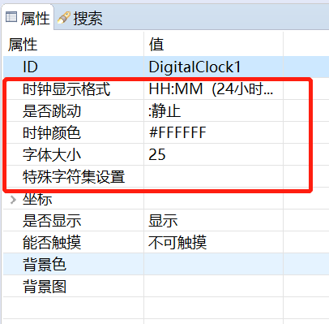
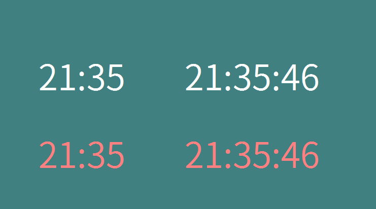

# 数字时钟
数字时钟是专用于时间显示的控件，在很多场景下，我们都需要显示时间，该控件会自动根据系统时间来显示。
## 如何使用
1. 双击打开UI文件
2. 在右侧控件集合中找到`数字时钟`控件
3. 鼠标左键点击`数字时钟`控件不放，然后将其拖拽到任意位置，松开左键，就能看到数字时钟的控件。
4. 选中刚才生成的数字时钟控件，在编辑器右侧的属性栏中，可以修改其属性内容，主要修改下面五个属性。

	
	
  * 时钟显示格式
	该属性设置时间的显示格式，可以选择24小时制或者12小时制，同时控制秒数是否显示。
  * 是否跳动
	该属性控制时钟中的`:`是静止还是跳动。
  * 时钟颜色
	该属性设置时钟文字的颜色显示。
  * 字体大小
	该属性数字时钟的文字大小
  * 特殊字符集设置  
	我们知道，根据asc码的定义，`字符 char` 与 `整形 int` 存在着对应关系。比如字符 `0` 的asc码为`48`。 特殊字符集就是将asc码映射为图片的一种功能。设置该功能后，当我们显示一个字符串时，系统会尝试将字符串中的每一个字符映射为指定的图片，最终显示一串图片到屏幕上。  
	具体使用方法请参考文本控件中的[特殊字符集的使用](textview.md)。  
    
5. 保存，下载调试，运行后，即可看到效果。  
6. 如果想修改时间， 则可以参考[系统时间](system_time.md)文档修改。

# 样例代码 

 

参考[样例代码](demo_download.md#demo_download)中的DigitalClockDemo项目  