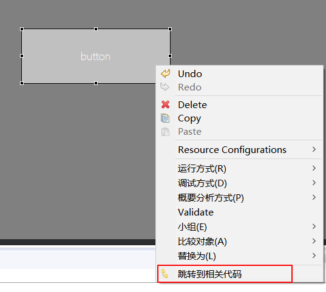
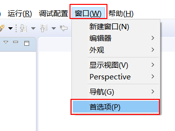
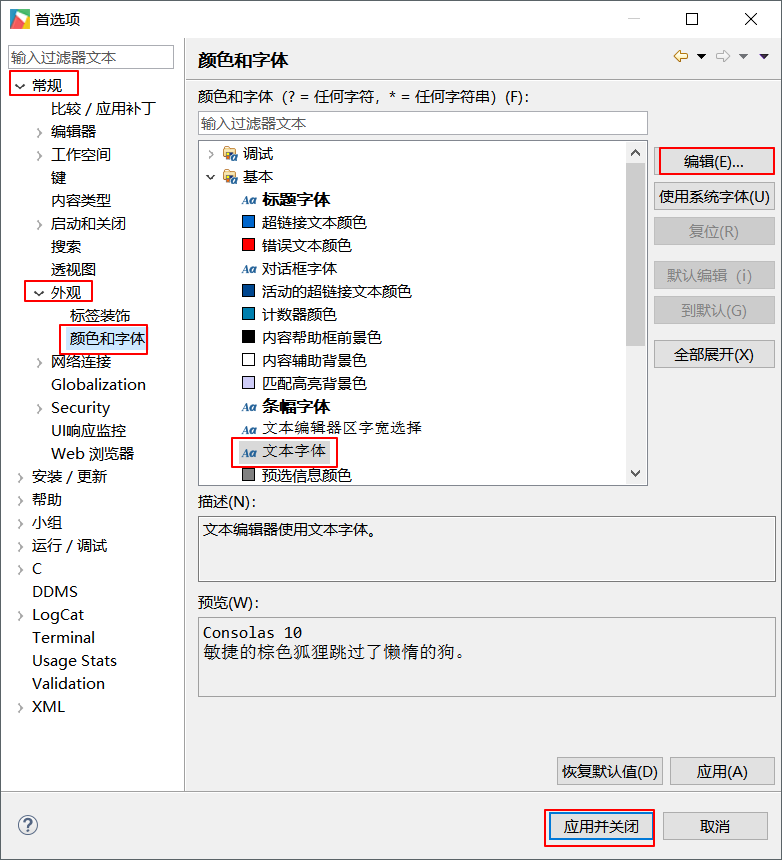
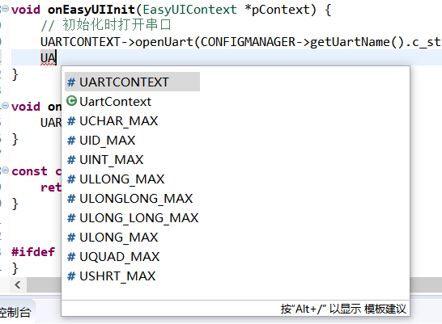
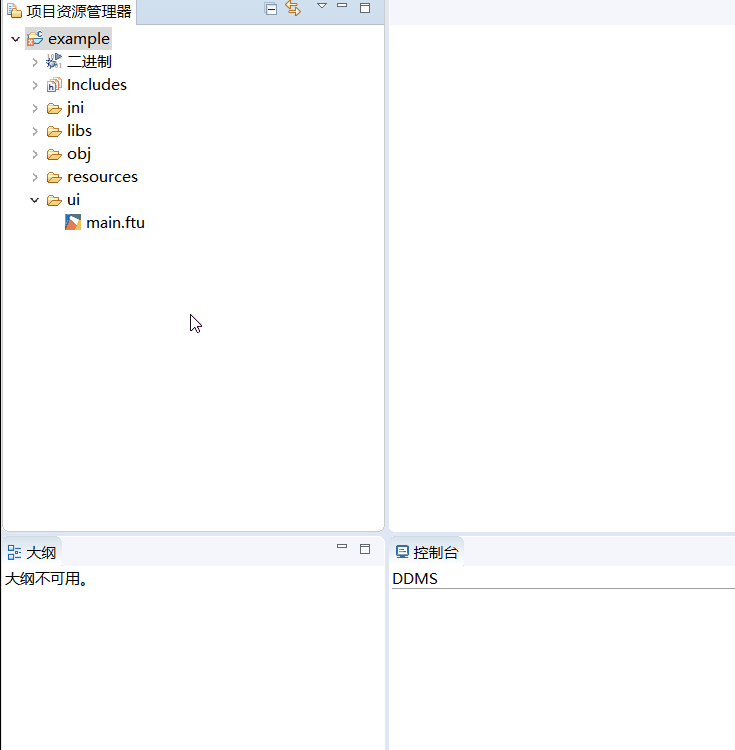

# Development tool common settings

##  Quickly jump to related functions
When we add too many controls to the UI file, multiple associated functions will also be generated in the **Logic.cc** file. If you want to find the associated function of a certain control is quite time-consuming.
Fortunately, the tool provides a function to quickly jump from the UI control to the relevant code.  
On the preview, select a control, right-click, and select ** Jump to Related Code** in the pop-up menu to open the corresponding Logic.cc file, and position the cursor to the position of the associated function of the control.  
 

   

> **Note: This function is only valid for control types that will automatically generate associated functions, such as the control types mentioned above. If you choose other control types, the function will only jump to the corresponding Logic.cc File and position the cursor at the bottom of the file. **
   
   
---     

## Modify font/font size
1. On the menu bar of the tool, select **Window** -> **Preferences**      

      

2.  In the pop-up box, select according to the following figure in turn to set the font.    
  
     

## Code smart completion
When editing the code, you first need to enter the starting part, and then type **Alt + /** to turn on the code completion function.    
As shown in the figure below, I input the two letters **UA** , and then type **Alt + /** shortcut key, you can see that there are multiple completion options, which can be selected with the up and down arrow keys. **Enter** key confirms the selection.  

  
  

## Rebuild index  
  If the code completion function fails, or the editor prompts a code error, but there is no problem with the compilation, please try to rebuild the index.  
 
 The steps to rebuild the index are as follows:
 
   
