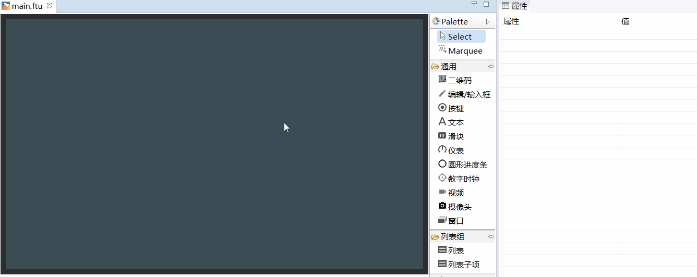
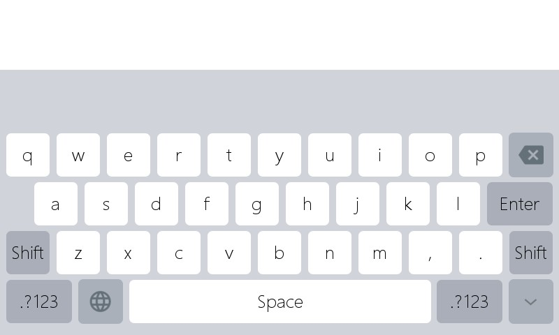

# Edit/input box
## I need a numeric keyboard, and I need the user to manually input Chinese, what should I do?
[How to add edit/input box](#add_edit_text)

## <span id = "add_edit_text">How to add edit/input box</span>
If you need numeric and Chinese input, you can quickly implement it using the existing `Edit/input box` control. The specific steps are as follows:
1. Double click to open the main.ftu file
2. Find the `Edit/input Box`control in the control set on the right
3. Left-click the `edit/input box`control and hold it, then drag it to any position, release the left button, you can see the control of the automatic edit/input box.  
4. In the properties on the right, select **Text Type** as needed. If you need to enter Chinese, then select **Text Type** as **Full Texy**, and in the **Project Properties** Enable Pinyin input method in.
5. When the download is running on the machine, click the `Edit/input` control, and a built-in input method or numeric keyboard will be automatically opened, so that you can enter text or numbers.
    
         

    Built-in Pinyin input method Screenshot
         
    
     Built-in numeric keyboard input screenshot
      
  
The default `edit/input box` is white, you can customize the appearance style in the attribute table on the right. Among them, the related attributes of the `edit/input box` are as follows:
  * **Is it a password box input**  
     If you choose Yes, when you simulate keyboard input, the character you are typing will be displayed as the specified `password character`, otherwise no change
  * **Password Characters**  
    If you select `Yes for password input`, the character you are typing will be displayed as the specified `password character`, otherwise no change
  * **Text Type**  
    There are two options for this attribute, namely 
       * Full text
      Means that you can enter Chinese, English and numbers without restriction.
       * Numbers only
      Indicates that only numbers can be input, others are restricted.
  * **Prompt text**  
     When the content in the simulated keyboard is empty, the prompt text will be displayed automatically.
  * **Prompt text color**  
   When the content in the simulated keyboard is empty, the prompt text will be displayed automatically, and the text color is the specified color.

## How to get the input content of the simulated keyboard?
When the `edit/input box` is successfully created, select **compile FlyThings** , its associated function will be automatically generated,  
Open the `jni/logic/****Logic.cc` file (\*\*\*\*represents the UI file name) in the project directory, and find the automatically generated function
（`XXXX` represents the control ID name）[Learn more about the relation function of the control](relation_function.md)
```c++
static void onEditTextChanged_XXXX(const std::string &text) {
	  //LOGD("The content currently entered is %s \n", text.c_str());
}
```
When the simulated keyboard input is finished, the system will automatically call this function, and the parameter `text` is the complete string on the current simulated keyboard.  
`std::string` is a string of C++ language type. You can also get the string pointer in C language through the following statement.
```
const char* str = text.c_str();
```
  


## How to convert a string to a number?  
In the associated function of the edit box, we can only get the string, so when we input the number, we need to convert the number string to the number.   
* `atoi`function can convert a string to a corresponding number, for example, “212” can be converted to an integer `213`  
  If illegal characters are encountered, the conversion will fail or the parsing will be interrupted. E.g:    
  `atoi("213abc");` return `213`  
  `atoi("abc");` return `0`
```
static void onEditTextChanged_EditText1(const std::string &text) {
  int number = atoi(text.c_str());
  LOGD("string to number = %d", number);
}
```
* `atof` function can convert a string to a corresponding floating point number, for example “3.14” can be converted to a floating point number `3.14`  
  If illegal characters are encountered, the conversion will fail or the parsing will be interrupted. E.g:    
  `atoi("3.14abc");` return `3.14`  
  `atoi("abc");`  return `0`
```
static void onEditTextChanged_EditText1(const std::string &text) {
  // The atof function can convert a string to a corresponding floating point number, for example, "3.14" can be converted to an integer 3.14
  //If the parameters are not standardized, the conversion will fail, and the number 0 will be returned uniformly
  double f = atof(text.c_str());
  LOGD("String to floating point = %f", f);
}
```

## How to customize the input method?
In addition to using the default input method, we can also customize the input method. [**Sample Code Package**](demo_download.md#demo_download) provides a demo example **ImeDemo**project.   
Currently only supports the customization of numbers and letters input, and the interface with Chinese input method cannot be customized.

There are some differences between the implementation of the input method interface and the ordinary interface:
1. The normal interface is implemented by inheriting `Activity` , and the input method needs to inherit `IMEBaseApp`;
2. In addition, the registration method is different. The normal interface registration method: `REGISTER_ACTIVITY(****Activity);`, the input method interface registration method: `REGISTER_SYSAPP(APP_TYPE_SYS_IME, ****Activity);`(\*\*\*\*indicates the UI file name)

These differences have been modified in the **ImeDemo** project, just migrate to your own project:
1. Copy the `UserIme.ftu` file in the ui directory to the ui directory of your own project;
2. Copy the files `UserImeActivity.h` and `UserImeActivity.cpp` in the activity directory to the activity directory of your own project;
3. Copy the `UserImeLogic.cc` file in the logic directory to the logic directory of your own project;

The subsequent operation is consistent with the normal interface programming, and the logic is written in `UserImeLogic.cc`;