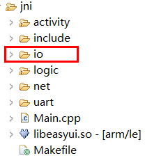
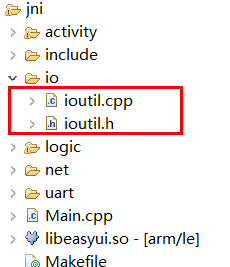

# File read and write
f you are familiar with file reading and writing in standard C language, you can read and write files in standard C language.

For some commonly used file read and write operations, we made a simple package based on the C language file read and write interface, which is convenient to use. If necessary, you can follow the steps to integrate the source code into your own project.


```c++
/**
 * Write a file, if the file exists, it will be overwritten, if the file does not exist, create a new file and write the content
 * Return true if successful
 */
bool WriteFile(const char* filename, const void* data, int len);

/**
 * Append content at the end of the file, if the file does not exist, create a new file first, and then write the content
 * Return true if successful
 */
bool AppendFile(const char* filename, const void* data, int len);

/**
 * 读文件
 * Read file
 * Success, save the file in the data of string in binary form, read the binary content with string.data()
 * Return an empty string on failure
 */
string ReadFile(const char* filename);
```

## Porting steps 
1. Create a new folder under the jni folder of the project and name it  `io`  
    
  
2. Downoad [ioutil.h](https://docs.flythings.cn/src/io/ioutil.h) 、[ioutil.cpp](https://docs.flythings.cn/src/io/ioutil.cpp) Two files, save them in the  `io` folder.  

    

## How to use 
* Introduce header files
  ```c++
  #include "io/ioutil.h"
  ```
* Write file
  ```c++
  //Write the string "0123456789" into the file 123.txt
  const char* filename = "/mnt/extsd/123.txt"; //The path where the file is saved
  const char* str = "0123456789";
  ioutil::WriteFile(filename, str, strlen(str));
  ```

* Additional files
  ```c++
  //Append the content to the end of the file, if the specified file does not exist, create a new file.
  const char* append_str = "abcdefgh";
  ioutil::AppendFile(filename, append_str, strlen(append_str));
  ```
  
* Read file
  ```c++
  const char* filename = "/mnt/extsd/123.txt";
  //Read all the contents of the file and save it in content
  string content = ioutil::ReadFile(filename);
  //Output each byte read to the log in hexadecimal
  for (size_t i = 0 ; i < content.size(); ++i) {
    LOGD("第%02d字节=0x%02X", i, content.data()[i]);
  }
  ```
  > [!Warning]
  > The `ioutil::ReadFile`function reads all the contents of the file into the memory. If the specified file is too large, it will cause insufficient memory and may cause an exception.


* Write files continuously, suitable for writing large files
  ```c++
  const char* filename = "/mnt/extsd/123.txt";
  const char* append_str = "abcdefgh";
  ioutil::Writer w;
  if (w.Open(filename, false)) {
    for (int i = 0; i < 5; ++i) {
      w.Write(append_str, strlen(append_str));
      w.Write("\n", 1);
    }
    w.Close();
  }
  ```

* Continuous reading, suitable for processing large files
  ```c++
  const char* filename = "/mnt/extsd/123.txt";
  ioutil::Reader r;
  if (r.Open(filename)) {
    char buf[1024] = {0};
    while (true) {
      int n = r.Read(buf, sizeof(buf));
      if (n > 0) {
        //There is read content, output every byte
        for (int i = 0; i < n; ++i) {
          LOGD("%02x", buf[i]);
        }
      } else if (n == 0) {
        //End of reading file
        break;
      } else {
        //Error
        break;
      }
    }
    r.Close();
  }
  ```


## Test code
```c++
/**
 * Triggered when the interface is constructed
 */
static void onUI_init() {
  //Write file
  const char* filename = "/mnt/extsd/123.txt";
  const char* str = "0123456789";
  ioutil::WriteFile(filename, str, strlen(str));
  string content = ioutil::ReadFile(filename);
  LOGD("Read bytes%d, content:%s", content.size(), content.c_str());
  //Append file
  const char* append_str = "abcdefgh";
  ioutil::AppendFile(filename, append_str, strlen(append_str));
  content = ioutil::ReadFile(filename);
  LOGD("Read bytes%d, content:%s", content.size(), content.c_str());

  ioutil::Writer w;
  if (w.Open(filename, false)) {
    for (int i = 0; i < 5; ++i) {
      w.Write(append_str, strlen(append_str));
      w.Write("\n", 1);
    }
  }
  w.Close();

  ioutil::Reader r;
  if (r.Open(filename)) {
    char buf[1024] = { 0 };
    while (true) {
      int n = r.Read(buf, sizeof(buf));
      if (n > 0) {
        //There is read content, output every byte
        for (int i = 0; i < n; ++i) {
          LOGD("%02x", buf[i]);
        }
      } else if (n == 0) {
        //End of reading file
        break;
      } else {
        //Error
        break;
      }
    }
    r.Close();
  }

  content = ioutil::ReadFile(filename);
  LOGD("Read bytes%d, content:%s", content.size(), content.c_str());

  //If it is a read binary file, not text, you should get the binary like this
  //Output each byte in hexadecimal
  for (size_t i = 0; i < content.size(); ++i) {
    LOGD("%02d byte=0x%02X", i, content.data()[i]);
  }
}
```