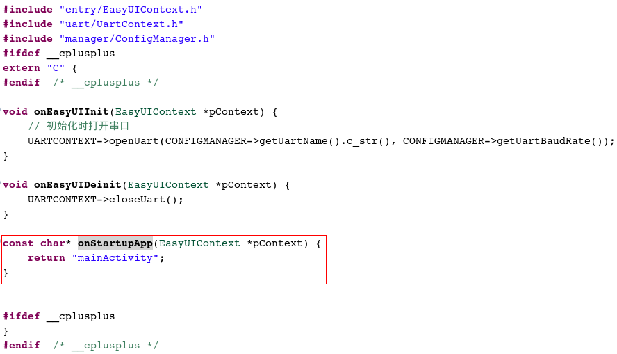
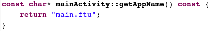

When we create a new project, there is a Main.cpp file in the generated template code, path: jni/Main.cpp; the template code is as follows:

The code in the red box is the startup interface code, and the interface is **mainActivity** . The corresponding UI resource file is **main.ftu**. Specifically, we can look at the code in jni/activity/mainActivity.cpp. It is clear which UI resource is corresponding:

