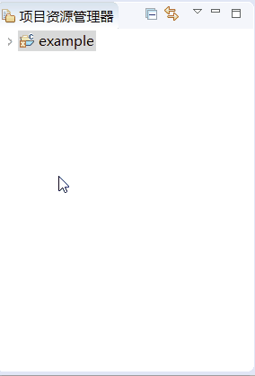
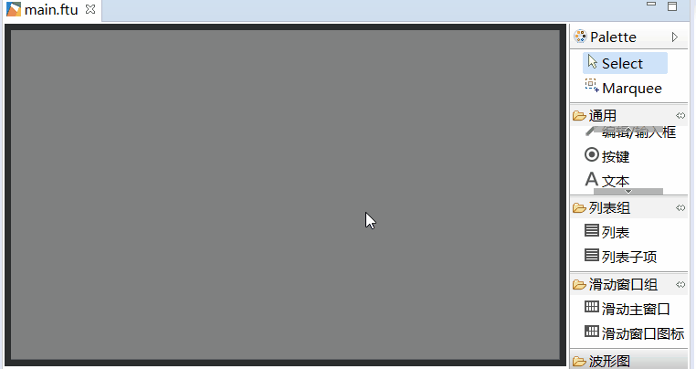
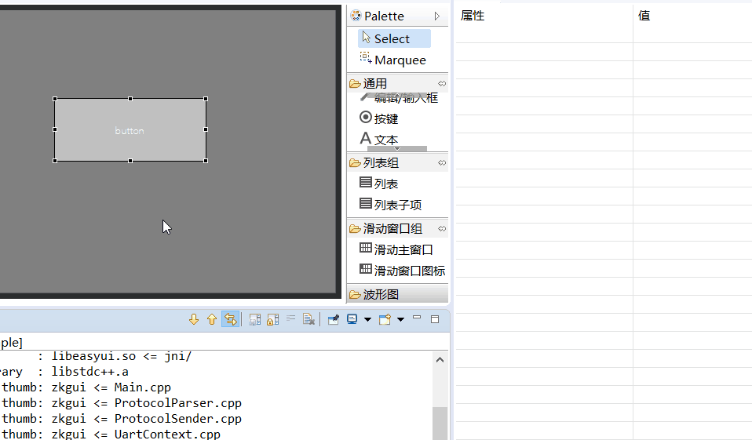
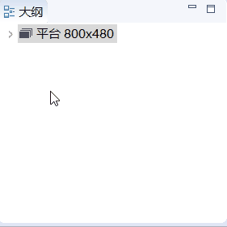
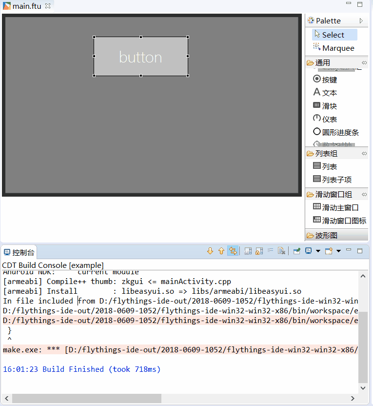

#  FlyThings IDE work area usage introduction  
When your new project is completed, you will see the following interface 
 
    
  
The editor is roughly divided into six areas. The respective functions are as follows:  
  1. **① Area-Project Explorer** It displays the resource files and code files in the project folder in the form of a tree diagram. You can expand/collapse freely, double-click the file to directly open it for editing. The specific demonstration is as follows:
  
        
 
  2. **② Area-UI edit box**  Mainly responsible for the editing and instant preview of the UI interface, it is the main operation area in the development
  3. **③ Area-Control Panel**  It contains all the built-in controls. You can click to select the control you need, and drag it to **②area** to complete the creation of the control. The specific demonstration is as follows:
  
       
    
  4. **④ Area - Property**  When you select a control in  **area②** , all its properties will be displayed here in the form of a table, and you can customize and modify it in the table. For example, to modify the text size, the specific demonstration is as follows: 
   
       
      
  5. **⑤ Area - Outline View** It displays all the created controls in the form of a tree diagram; also supports free expansion/collapse; can clearly understand the hierarchical relationship between the controls; and can be directly dragged and dropped A certain node can quickly adjust the position of the hierarchy; double-click the node to quickly show/hide the controls. This is very easy to use when the hierarchy is complicated. The specific demonstration is as follows:  
 
     
 
  6. **⑥ Area - Console** When compiling the code, this location will output the compilation log. If the compilation fails, double-click **error prompt content**to jump directly to the corresponding code.  
 As shown in the figure below, it demonstrates that double-click the error message and jump directly to the code. 
 
     

With the above foundation, now, we can officially start development.

