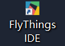
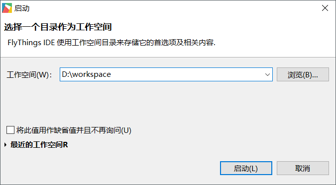
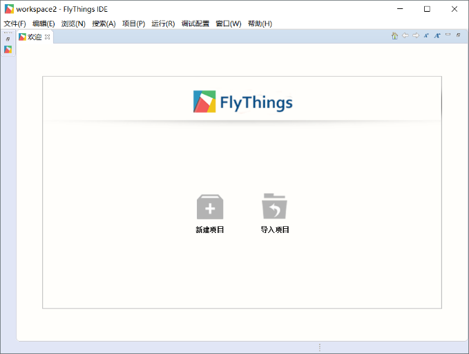

# Use FlyThings integrated development tool for the first time
If you have successfully installed [FlyThings IDE](download.md), then on your desktop, find the  shortcut and double-click to run it.  
If you delete the shortcut, you can also find  in the `bin` folder in the installation directory and run it directly.
## Choose a workspace
When you run the tool, the following interface will pop up.
* **Workspace** is used to store related settings and historical records. You can understand it as a container, which can manage multiple projects at the same time, so there is no need to run multiple development tools at the same time.

   
## Welcome Screen
If you open the software for the first time, or choose a new workspace, then you will see a welcome interface like the picture below.
It provides two shortcut functions: **New Project** and **Import Project**      
  * **New Project**  
    It will guide you step by step [How to create a new FlyThings project](new_flythings_project.html)
  * **Immport project**  
    Through it, you can import existing projects into the current workspace and continue previous development.[How to import a project](import_project.md)
    
      
    
 We are not in a hurry to **New Project** , first select  in the upper left corner to close the welcome interface.  
If you want to reopen the welcome interface, on the top **menubar** , select **Help -> Welcome** menu in turn.     
 
   

    
