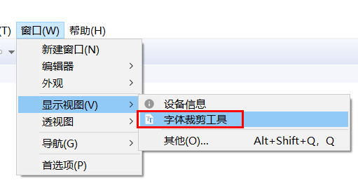
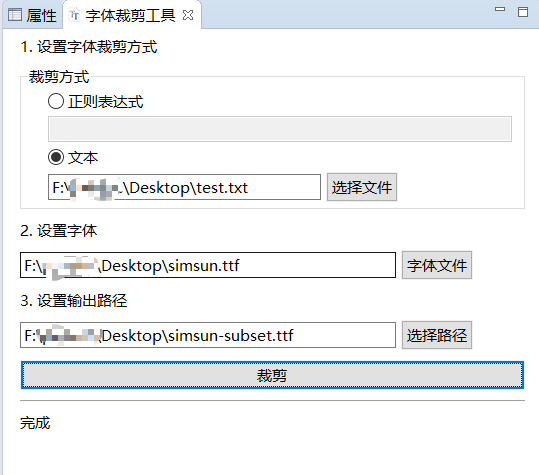

### Font cropping

In the project, custom fonts may be used, but the full font of 10M is not suitable for use in the project.
Moreover, usually we only use a small part of the font, cutting out the unnecessary characters, which can greatly save the space consumption of the font, and also speed up the startup speed of the screen.

### Use of font cutting tools
In the menu bar of the development tools, you can find the font cropping tool.
  
  ，

  

1. First select the font cropping method. The purpose of this step is to determine which characters in the font are retained. 
   * Regular expression  
     Support java regular expressions, for example  `\d` means all numbers
   * Specify text  
    Specify a text file, **Ensure that the file encoding is UTF-8** , all text in the file content means the text that needs to be retained.  （Recommended method: simple and intuitive）
2.  Set the font  
    Specify the path of the full font.
3.  Set the output path   
   Specify the save path of the new font after the font is cropped. If the file already exists, it will be overwritten.
4. After setting the above parameters, click **Crop** 
5. If the prompt is completed, the cutting is successful, and the newly generated font file can be seen in the output path. It can be found that the cropped font file is smaller than the complete font.

### Example
Create a new txt file, the content of the file is only “Hello” one word, **Save the code as UTF-8** . After setting the parameters and cutting, the final generated ttf file size is less than 10KB.  
 The cropped font can be verified in [Online Font Editor](http://fontstore.baidu.com/static/editor/index.html) which characters it contains.

