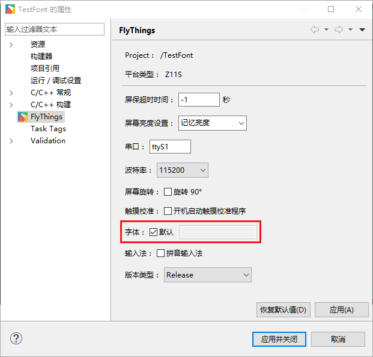
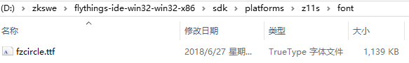

# Font library settings
The default font library packaged by FlyThings system is **Siyuan HeiTi font**, we can view the project properties:

The font option is checked by default, and the compiled upgrade file will be packaged in the **fzcircle.ttf** font librery in the **font** directory of the corresponding platform in the tool installation directory

This font library is the **Siyuan HeiTi font library**, we made some cuts and renamed it **fzcircle.ttf**; 
If we want to use other font libraries, just remove the default options and import a new font library  （**note that this font library only supports ttf format**）：

**Z6S and later platforms**  Our system has built-in **fzcircle.ttf** font library directly, the purpose is to speed up the boot speed, if any fonts are missing, we need to customize an extended font library by ourselves, the same as **Siyuan Heibody Font**, the name of the font library is also  **fzcircle.ttf**, the import method is the same as above, so that when the system loads fonts, the built-in fonts in the system will be loaded first, and the corresponding fonts in the extended font library will be loaded if the loading fails; if you want to use other fonts Library, the name of the imported font library is not **~~fzcircle.ttf~~** , so the loaded fonts are all external fonts. 

To summarize: 
**Z11S platform** : Because the platform system does not have a built-in font library, the system directly uses the font library packaged by the tool, and there is no extension of the font library. Remember, the default package is **Siyuan bold font fzcircle .ttf fzcircle.ttf**；  
**Z6S and later platforms** : The system has a built-in **fzcircle.ttf** font library, supports extended font library, the same as **Siyuan HeiTi font** , the name of the font library must be **fzcircle.ttf**; When using other font libraries, the imported font library name cannot be **~~fzcircle.ttf~~**;