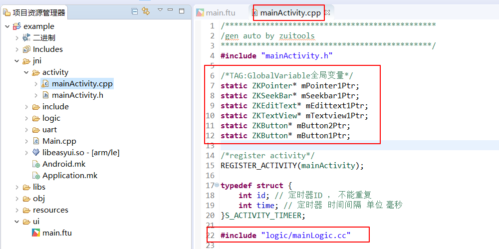
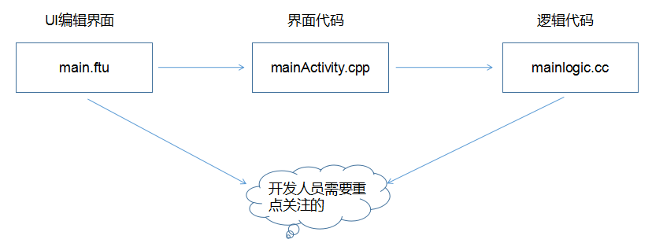

# <span id = "ftu_and_source_relationships">FlyThings编译过程以及UI文件与源代码的对应关系</span>
## UI文件中的控件是如何与指针变量关联的
FlyThings 将UI与代码区分开来，方便管理。 
下文中，UI文件是指项目 **ui** 文件夹下的 所有 **ftu** 文件。
为了减少开发中编写重复代码，我们改进了编译过程。在真正的源码编译之前，工具会根据 UI文件生成相同前缀名的`Logic.cc` 文件，例如`main.ftu`会生成配对的`mainLogic.cc`文件，这里需要注意的是：  
`Logic.cc`文件的生成，并不是直接覆盖，而是增量修改。  
编译时，工具会遍历每个UI文件，读取UI文件中包含的控件。并且为这个控件声明指针变量，在代码中，通过这个指针，就可以操作对应的控件。 指针变量定义在同前缀名的 `Activity.cpp` 文件中。以**main.ftu**为例，就像这样：  

  

**图中可以看到， 所有指针为静态全局变量，它们都具有相同的命名规则，具体命名规则请参考[控件ID名与指针变量名的命名规则](named_rule#id_name_rule.md)；并且，你还应该注意到截图中 `#include "logic/mainLogic.cc"` 这条语句，它将 `mainLogic.cc`文件include到`mainActivity.cpp`当中，而我们的业务代码就是写在`mainLogic.cc`文件里，所以，我们可以在`mainLogic.cc`中完全使用这些控件指针。**  
如果你对这些指针的初始化感兴趣，可以在`mainActivity`的`onCreate`方法中找到。

## UI文件与Logic.cc文件的关系
现在，你大概已经知道了UI文件里的控件是如何与这些指针联系起来的。  让我们再来看看`mainLogic.cc`文件里又为我们自动生成了哪些代码。  
如果你的UI文件中没有添加任何控件，那你的`mainLogic.cc`文件将是这样的:   

```c++ 
/**
 * 注册定时器
 * 填充数组用于注册定时器
 * 注意：id不能重复
 */
static S_ACTIVITY_TIMEER REGISTER_ACTIVITY_TIMER_TAB[] = {
	//{0,  6000}, //定时器id=0, 时间间隔6秒
	//{1,  1000},
};

/**
 * 当界面构造时触发
 */
static void onUI_init(){
    //Tips :添加 UI初始化的显示代码到这里,如:mText1Ptr->setText("123");

}

/**
 * 当切换到该界面时触发
 */
static void onUI_intent(const Intent *intentPtr) {
    if (intentPtr != NULL) {
        //TODO
    }
}

/*
 * 当界面显示时触发
 */
static void onUI_show() {

}

/*
 * 当界面隐藏时触发
 */
static void onUI_hide() {

}

/*
 * 当界面完全退出时触发
 */
static void onUI_quit() {

}

/**
 * 串口数据回调接口
 */
static void onProtocolDataUpdate(const SProtocolData &data) {

}

/**
 * 定时器触发函数
 * 不建议在此函数中写耗时操作，否则将影响UI刷新
 * 参数： id
 *         当前所触发定时器的id，与注册时的id相同
 * 返回值: true
 *             继续运行当前定时器
 *         false
 *             停止运行当前定时器
 */
static bool onUI_Timer(int id){
	switch (id) {

		default:
			break;
	}
    return true;
}

/**
 * 有新的触摸事件时触发
 * 参数：ev
 *         新的触摸事件
 * 返回值：true
 *            表示该触摸事件在此被拦截，系统不再将此触摸事件传递到控件上
 *         false
 *            触摸事件将继续传递到控件上
 */
static bool onmainActivityTouchEvent(const MotionEvent &ev) {

	return false;
}
```
这些函数的具体作用如下：  
* **REGISTER_ACTIVITY_TIMER_TAB[ ] 数组**  
 用于[注册定时器](timer.md#timer)； 数组成员类型为如下结构体  
```c++
typedef struct {
	int id; // 定时器ID ， 不能重复
	int time; // 定时器  时间间隔  单位 毫秒
}S_ACTIVITY_TIMEER;
```
**实质上，这个数组将在 `mainActivity.cpp`的`rigesterActivityTimer()`函数中引用，通过调用 `void registerTimer(int id, int time)`方法依次注册到系统中。**

* **void onUI_init()**  
 用于界面初始化，如果在打开这个UI界面的时候，你需要初始化一些内容，那么你可以将代码添加到这函数里。  
 实质上，这个方法将在`mainActivity.cpp`的`onCreate()`方法中调用。你可以理解为`mainActivity`的构造。

* **void onUI_quit()**  
 用于界面的退出，如果你需要当UI界面退出的时候做一些操作，那么你可以将代码添加到这函数里。
实质上，这个方法将在`mainActivity.cpp`的析构函数中调用

* **void onProtocolDataUpdate(const SProtocolData &data)**  
 用于接收串口数据。当解析到串口数据帧时，会调用该函数。  
 实质是， `mainActivity.cpp`的`onCreate()`中，会默认调用`void registerProtocolDataUpdateListener(OnProtocolDataUpdateFun pListener)`进行接收串口数据的注册， 在`mainActivity.cpp`的析构中取消注册。当串口读到数据时，通过`ProtocolParser.cpp`中的`void notifyProtocolDataUpdate(const SProtocolData &data) `依次调用已注册的UI界面。  
这是`ProtocolParser.cpp`中的串口解析函数，结合上面描述的过程，你应该就能理解串口数据是如何在各个界面分发的：

    ```c++
    /**
     * 解析每一帧数据
     */
    static void procParse(const BYTE *pData, UINT len) {
        switch (MAKEWORD(pData[3], pData[2])) {
        case CMDID_POWER:
            sProtocolData.power = pData[5];
            break;
        }

        // 通知协议数据更新
        notifyProtocolDataUpdate(sProtocolData);
    }
    ```

* **bool onUI_Timer(int id)**  
 定时器回调函数； 当某个定时器达到规定的时间间隔后，系统将调用该函数，当添加了多个定时器时，你可以通过 **id** 参数，区分定时器。这个 **id** 参数与 上面结构体数组中填写的 id 相同。  
返回 `true` 则继续运行当前定时器;  
返回 `false` 则停止运行当前定时器;  
如果你通过返回 `false`停止了定时器，那么如何再次开启它呢？可以参考 [如何任意开启停止定时器](how_to_register_timer.md)
* **bool onmainActivityTouchEvent(const MotionEvent &ev)**  
 触摸事件回调函数。能够得到所有的触摸消息。  
 同样，该函数也是在`mainActivity.cpp`中通过`registerGlobalTouchListener`方法默认注册；只有注册之后才能得到触摸消息。  
 返回 `true` 则表示该触摸事件在此被拦截了，不再传递到控件上  
 返回 `false` 则表示触摸事件将继续传递到控件上  
 [了解更多触摸事件的处理](motion_event.md)
 
 
以上是默认的UI文件编译生成的Logic.cc。当我们在UI文件中添加控件后，再次编译时，工具会根据不同的控件生成不同的关联函数到对应的Logic.cc文件中。  
例如：我在**main.ftu** 这个 UI文件中添加了两个按键控件，它们的ID分别是 `Button1` 、`Button2`，那么，经过编译之后，在 **mainLogic.cc**文件中会生成以下两个关联函数  
```c++
static bool onButtonClick_Button1(ZKButton *pButton) {
    //LOGD(" ButtonClick Button1 !!!\n");
    return false;
}

static bool onButtonClick_Button2(ZKButton *pButton) {
    //LOGD(" ButtonClick Button2 !!!\n");
    return false;
}
```
注意函数的命名，函数名称中包含了控件的ID名，所以我们要求控件的ID命名需要符合C语言命名标准。  
如果你不断的添加控件，那么编译后会生成更多的关联函数到 **mainLogic.cc** 文件中。  
通常，在开发中，我们会在UI文件中多次增加、删除、修改控件，针对这些情况，目前的解决方案如下：  
 * 对于增加控件的情况，编译时工具会根据控件ID名生成关联函数，如果已经存在相同的关联函数，那么将略过。不会对**Logic.cc**文件造成任何影响。  
 * 对于删除控件的情况，如果在UI文件中，将已有的控件删除，工具并不会将它的关联函数也删除。如果将关联函数也删除，那么很可能会造成客户代码的丢失，所以，我们选择保留它。
 * 对于修改控件的情况，关联函数的生成只与控件ID名有关，如果你在UI文件中，修改控件除了ID名的其他属性，将不会对关联函数造成影响；如果你修改了控件ID名属性，那么编译时，将按照增加控件的情况来处理，旧关联函数保留。


**上面我们只以按键控件为例，讲述了UI文件中的控件与Logic.cc内生成的关联函数的关系，FlyThings还提供生成其他控件的关联函数，比如 滑动条、列表、滑动窗口等控件，了解其他控件的关联函数，请参考[控件自动生成的关联函数讲解](named_rule.md#relation_function)**

<br/>

**最后用一张图来总结ftu文件与代码的对应关系：**
