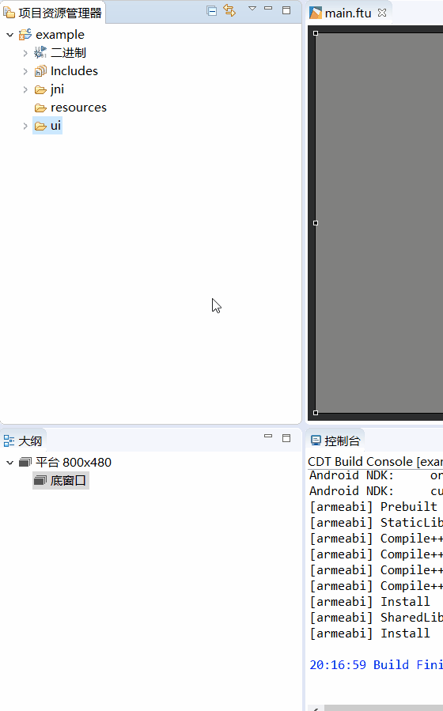
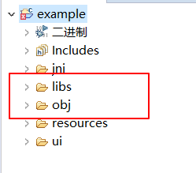
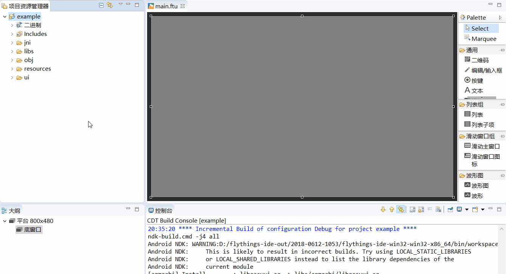

# How to compile the FlyThings project
Compiling the FlyThings project is very simple. According to different operation methods, there are three ways to compile as follows. 
## 1. Choose Compile from Project Explorer
The specific steps are: In the project explorer, left-click to select the name of the project to be compiled, then right-click, and in the pop-up menu, select the **compile FlyThings** option to automatically compile the project. The animation of the operation is as follows:

   
## 2. Select compile via the toolbar 
There is a shortcut to compile on the toolbar at the top of the software. Similarly, first in the project explorer, left-click to select the name of the project to be compiled, and then find on the toolbar  the green triangle button, click it to compile the selected project .

## 3. Compile by shortcut keys
You may have noticed the compilation shortcut in the above two steps, that is, **Ctrl + Alt + Z**. It is strongly recommended to use this method for compilation. After editing the code, directly **Ctrl + Alt + Z** quickly completes the compilation, which is very convenient.

# How to clean up the project
After the project is compiled, some compiled object files and intermediate files are usually left. For example **libs** and **obj** folders , Their existence is to speed up compilation and achieve incremental compilation.

  
You can delete them manually, or automatically clean them up through the menu.
* Manually delete  
 First select the folder to be deleted, right-click, and in the pop-up menu, select the  **Delete** option.
 
  
 
* Automatic cleaning  
If you always perform the deletion manually, it may cause misoperation and cause the loss of important files. Therefore, using automatic cleaning can effectively avoid this situation.
Similarly, first select the name of the project to be operated, right-click, and select the **Clear Project** option in the pop-up menu. It will automatically delete the compiled intermediate files in the **libs** folder and **obj** folder.  
It is recommended to use this method to clean up files.

**Note: If you encounter strange problems during compilation, or the source code is not compiled into the program, you can try to clean the project first, and then recompile. Especially when you import other people's projects, this situation tends to happen frequently. **

# How to recompile
If you want to completely recompile the code, then you can clean up the project and compile again

