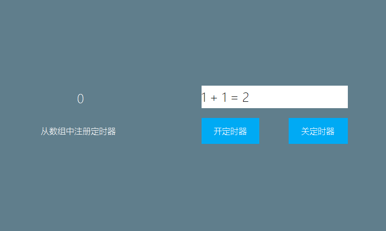

# How to start and stop the timer arbitrarily
We can add a preset timer in `REGISTER_ACTIVITY_TIMER_TAB` , but this method is not flexible enough to start/stop arbitrarily. Here is another way to add a timer.
There are three methods about timers in the Activity class. The following describes how to use them.
```c++
/**
 * Register timer
 */
void registerUserTimer(int id, int time);
/**
 * Cancel timer
 */
void unregisterUserTimer(int id);
/**
 * Reset the timer
 */
void resetUserTimer(int id, int time);
```

1. In logic.cc, add a variable to identify whether the timer has been registered.

    ```c++
     /**
      * Whether the timer is registered
      */
     static bool isRegistered = false;
     #define TIMER_HANDLE   2

    ```
2. We add two more buttons. In the click event of the button, we add codes for registering and canceling the timer respectively.

    ```c++

    static bool onButtonClick_ButtonTimerOn(ZKButton *pButton) {
        //If not registered, register the timer
        if (!isRegistered) {
            mActivityPtr->registerUserTimer(TIMER_HANDLE, 500);
            isRegistered = true;
        }
        return false;
    }

    static bool onButtonClick_ButtonTimerOff(ZKButton *pButton) {
        //If the timer is already registered, cancel the registration
        if (isRegistered) {
            mActivityPtr->unregisterUserTimer(TIMER_HANDLE);
            isRegistered = false;
        }
        return false;
    }

    ```

> [!Warning]
> The above-mentioned three functions `registerUserTimer`,`unregisterUserTimer`,and`resetUserTimer` cannot be called in the  `onUI_Timer` function, which will cause deadlock.
 
## <span id = "example_download">Sample code</span>
Refer to the TimerDemo project in [Sample Code](demo_download.md#demo_download) .  
Preview effect picture:


     