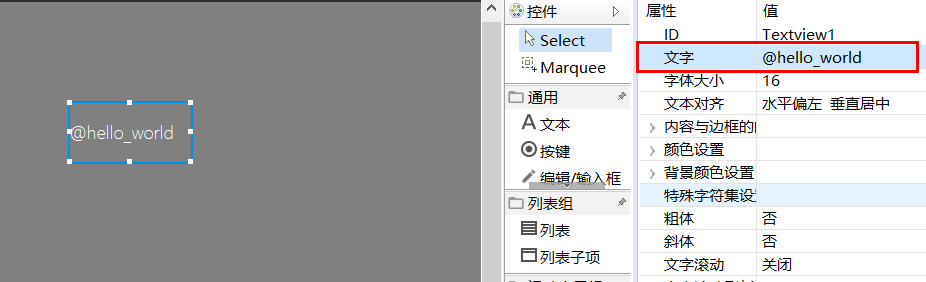
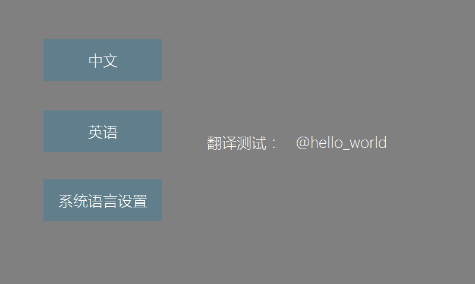

## Multi-language translation
FlyThings provides multi-language translation function to facilitate internationalization.
### How to add translation
1. First, create a translation file through the new wizard.
   
   
   
2. After creation, a subfolder named **i18n** will be generated under the project, and the default tr translation file will be added. The file name of each tr file represents the corresponding language (do not modify the file name at will).
3. Double-click to open the tr file, you can see that the content is in xml format. Each string tag represents a translation. The **name** attribute is used to give this translation an alias (it is recommended to name it as a combination of English, numbers, and underscores), and then use the alias to represent the string in the code.
> Note: In the same configuration file, the alias cannot be repeated.  
 
     ```xml
    <?xml version="1.0" encoding="utf-8"?>
    <resources>
        <string name="hello_world">Hello World!</string>
        <string name="hello_flythings">Hello, FlyThings</string>
    </resources>
    ```
If you want to wrap in the string, use `&#x000A;`escape, as follows:
    ```xml
    <?xml version="1.0" encoding="utf-8"?>
    <resources>
        <string name="new_line_test">The first line &#x000A;The second line </string>
    </resources>
    ```
As shown above, we will alias the string  **“Hello, world!”** as `hello_world`, and alias the string **hello, FlyThings** as `hello_flythings`, if we want to add For more translations, we just need to add the `string` tag according to the example. 
4. Since it is a multi-language translation, we need to add the same `name` tag to each language. In this way, when we switch languages, the system will replace the content according to the `name` attribute.
5. After the configuration file is added, we can use it in the ui file and code.
6. Open the ui file, we can enter **@hello_world** in the text property (we use the **@** symbol followed by the alias in the configuration file to indicate that this string needs to be translated). Then, we download and run, you can see that the content of the text has been automatically translated into **Hello, world！**    

      
  
7. We can also translate strings in the code. Previously, we used the `setText()` member method to set the string. If we need automatic translation, we need to use the `setTextTr()` member method.
E.g:     
 ```c++
/**
 *  Triggered when the interface is constructed
 */
static void onUI_init() {
	//The setTextTr parameter is the name value in the translation configuration file. Note: The string passed in here does not need to be preceded by the @ symbol
	mTextview1Ptr->setTextTr("hello_world");
}
 ```
 Download and run, we can see that the content has been replaced with the corresponding string.

8. We can also get the value corresponding to the current language name, and then do some operations similar to splicing, etc.:

```c++

#include "manager/LanguageManager.h"

static bool onButtonClick_Button1(ZKButton *pButton) {
    //LOGD(" ButtonClick Button1 !!!\n");
    std::string hello = LANGUAGEMANAGER->getValue("hello");
    std::string world = LANGUAGEMANAGER->getValue("world");
    std::string ret = hello + " " + world;
    LOGD("ret: %s\n", ret.c_str());
    return false;
}

```

### How to switch languages
1. The default language of the system is **zh_CN** （Simplified Chinese）。 
2. You can open the system's built-in language switch interface to select a language.
Add the following code to open the interface.
```c++
EASYUICONTEXT->openActivity("LanguageSettingActivity");
```
Or use the following API to switch languages freely.

   ```c++
     EASYUICONTEXT->updateLocalesCode("zh_CN"); //Set to Chinese
     EASYUICONTEXT->updateLocalesCode("en_US"); //Set to Englisg
     EASYUICONTEXT->updateLocalesCode("ja_JP"); //Set to Japanese  
   ```   

### Font requirements   
   Multilingual translation requires font support. If the text does not exist in the font, it will be displayed abnormally. Therefore, the font must contain text in multiple languages.
   > The default font of the system is a simplified version, it is recommended to add a custom font, see [font cutting](font_cut_tool.md)。

### Sample
For the complete source code, please see the **TranslationDemo** project in [**Sample Code Package**](demo_download.md#demo_download)




