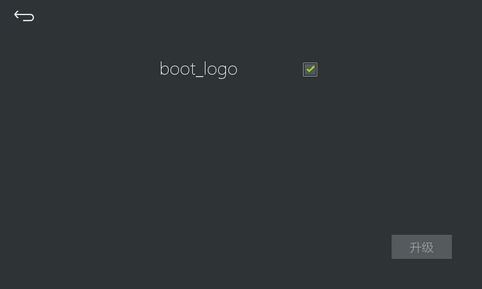
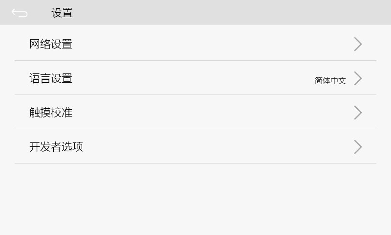
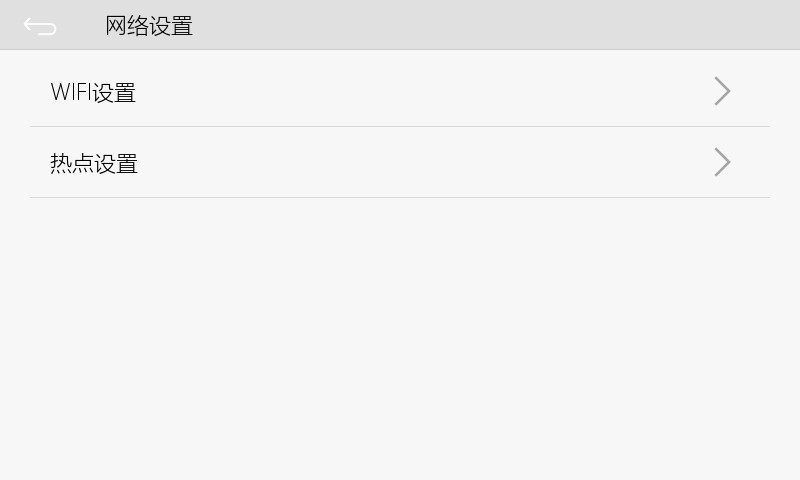
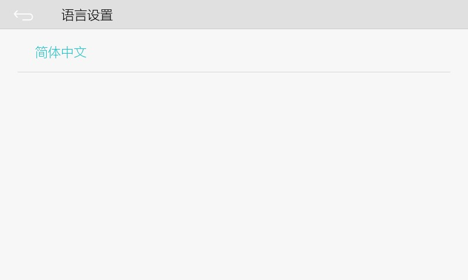
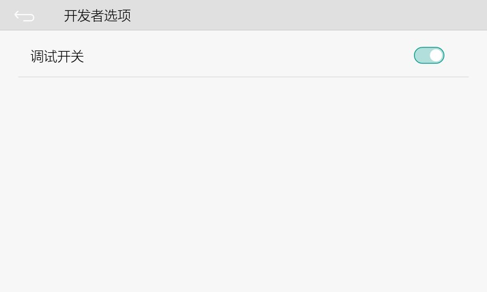

In addition to the interface customized by the developer, our system also has several commonly used interfaces built in, such as the interface that appears when the card is upgraded, which is one of the built-in interfaces;


In addition, there is a system setting interface, open method:
```c++
EASYUICONTEXT->openActivity("ZKSettingActivity");
```
We can click on a button to jump to this interface to see the effect （the effects of several other built-in interfaces can be viewed in the following ways）：
```c++
static bool onButtonClick_Button1(ZKButton *pButton) {
    EASYUICONTEXT->openActivity("ZKSettingActivity");
    return false;
}
```


After each item is clicked in, there is a new built-in interface, open the network settings:
```c++
EASYUICONTEXT->openActivity("NetSettingActivity");
```


Open WIFI settings:
```c++
EASYUICONTEXT->openActivity("WifiSettingActivity");
```


If the target machine supports wifi, turn on the switch in the upper right corner, the searched wifi information will be displayed on the interface;

Open the hotspot setting interface:
```c++
EASYUICONTEXT->openActivity("SoftApSettingActivity");
```


Back to the system setting interface just now, we click to open the language setting interface:
```c++
EASYUICONTEXT->openActivity("LanguageSettingActivity");
```


Touch calibration interface:
```c++
EASYUICONTEXT->openActivity("TouchCalibrationActivity");
```


Developer options interface:
```c++
EASYUICONTEXT->openActivity("DeveloperSettingActivity");
```


Currently there are only ADB debugging switch options.
