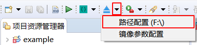
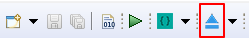
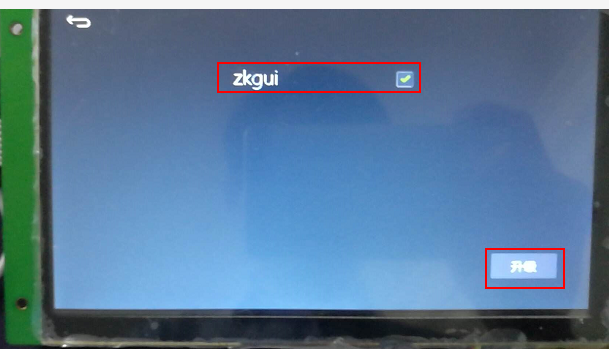

# 制作升级镜像文件
在之前的教程中，我们通过[下载调试](adb_debug.md#下载调试)菜单运行程序，但是**它并不能将程序固化到设备中，如果您拔掉TF卡或者断电重启，程序将自动恢复**。 如果您希望**固化程序**到设备中，我们可以将程序打包制作成升级文件，设备升级后，就可以将程序固化在设备内部，一上电，默认就会启动该程序。

## 操作具体步骤  
首先我们要配置镜像的输出目录。
1. 找到工具栏上的这个按钮  

      

2. 点击旁边的黑色下拉箭头，在弹出的菜单中选择 **路径配置**    

   

3. 在弹出框中，选择镜像文件的输出目录，点击确定 。

4. 在上面的步骤中，我们配置好了输出目录，现在点击下图中的按钮开始编译，它会将编译结果  打包，并生成 **update.img** 文件输出到配置的目录下。  

     

6. **update.img** 文件成功生成后，将其拷贝到TF卡里(**注意：使用前，请将TF卡格式化为FAT32格式**)，将TF卡插入机器中，机器重新上电，这时候，系统检测到TF卡里的文件，就会启动升级程序，在下图的界面中，勾选升级的项目，点击升级。升级完成后及时拔掉升级卡，防止重复升级。    
  > [!NOTE]
  > **注意：TF卡仅支持FAT32格式**

   

**如果屏幕损坏或触摸不准情况下，导致不能通过点击按钮进行升级，那么这种情况下，我们可以通过**[**自动升级**](autoupgrade.md)**这种方式来升级我们的系统。**
