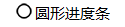
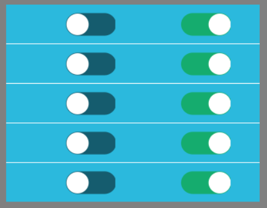

# Control naming rules
Most of the controls we add to the UI file will automatically generate a corresponding pointer variable and a macro-defined integer value after being compiled.
## <span id="id_name_rule">Naming rules for control ID names and pointer variable names</span>

The pointer variable name consists of three parts.
Respectively fixed lowercase **m** as the prefix + **ID** name + **Ptr** as the end 
Take the control whose ID attribute is **Textview1** as an example 

 
 
After compilation, the generated corresponding pointer variable is named **`mTextview1Ptr`**  

  

The type of pointer variable depends on the type of control. The pointer types corresponding to each control are as follows:   
The header files of each class can be found in the project **jni/include** folder.

| Control name | Class name 
|:--------:|:-------:
|    | ZKQRCode  | 
|    | ZKEditText   |
|    | ZKButton    |
|     | ZKTextView   |
|    | ZKSeekBar   | 
|    | ZKPointer   | 
|    | ZKCircleBar   | 
|    | ZKDigitalClock   | 
|    | ZKVideoView   | 
|    | ZKCameraView   | 
|  | ZKWindow |
|  | ZKListView |
|   | ZKSlideWindow |
|   | ZKDiagram |

## <span id="id_macro_rule">Control ID name and macro definition integer value naming rules</span>
This macro definition represents the mapping relationship of controls in the UI file.
The macro definition consists of three parts. They are composed of fixed uppercase `ID`, uppercase UI file name, and control ID attribute name.  
Take the control whose ID attribute is **Textview1** as an example  

 
 
After compilation, the corresponding macro statement generated is ** `#define ID_MAIN_TextView1 50001` **


> [!Warning]
> Do not change the integer value of the macro definition at will, otherwise it will cause the program to be abnormal.

## <span id = "relation_function">Explanation of the associated function automatically generated by the control</span>
The associated function automatically generated by the control explains that some controls will automatically generate the associated function. The specific explanation of the associated functions generated by these controls is as follows:  
> [!Note]
>  **The `XXXX` in the function represents the control ID name, please replace it yourself in the actual process**

* ### Button control  
   ```c++
   static bool onButtonClick_XXXX(ZKButton *pButton) {
      return false;
   }
   ```
   When the button is clicked, this function is called.
   
     * **The parameter `ZKButton *pButton`** is the pointer of the clicked button, and a series of operations can be performed on the control through the member functions of the pointer. This pointer is the same object as the object pointed to by the global variable `mXXXXPtr`.

* ### Edit input box control
  ```c++
  static void onEditTextChanged_XXXX(const std::string &text) {
    
  }
```
When the text in the input box changes, the system will automatically call this function. 
  * **The parameter `std::string &text`** is the complete string in the current input box.

* ### Slider control
  ```c++
  static void onProgressChanged_XXXX(ZKSeekBar *pSeekBar, int progress) {
  
  }
```
When the current progress value of the slider changes, the system will automatically call this function.  
  * **The parameter `ZKSeekBar *pSeekBar`**  is the pointer of the slider control, and a series of operations can be performed on the control through the member functions of the pointer.  
  * **The parameter `int progress`** is the progress value of the current slider

* ### <span id = "slidewindow"> Sliding window control</span>
  ```c++
  static void onSlideItemClick_XXXX(ZKSlideWindow *pSlideWindow, int index) {
    
  }
```
When you click an icon in the sliding window control, the system will automatically call this function.  
  * **The parameter `ZKSlideWindow *pSlideWindow`**  is the pointer of the sliding window control, and a series of operations can be performed on the control through the member functions of the pointer.  
  * **The parameter `int index`** is the index value of the currently clicked icon. For example, a total of 10 icons are added to the sliding window, and the index value range is [0, 9]

* ### <span id = "list">List control</span>
The list control is the most complex control, it will create three associated functions. Although there are many functions, it is very easy to understand according to the following steps.  
  1. First, if the system wants to draw a list control, it needs to know how many items it has. So there is the following correlation function
   ```c++
   static int getListItemCount_XXXX(const ZKListView *pListView) {
    
         return 0;
   }
   ```  
   
     * **The parameter `const ZKListView *pListView`**  is the pointer of the list control, which points to the same object as the global variable `mXXXXPtr`.  
     * **The return value ** is an integer, which means how many items there are in the list, which can be defined according to your needs. 

  2. After the system knows the number that needs to be drawn, it is not enough. It also needs to know what content you display for each item.  
     So with the following function, it will be called multiple times to let you set the display content of each item until each item is processed.
   ```c++
     static void obtainListItemData_XXXX(ZKListView *pListView,ZKListView::ZKListItem *pListItem, int index) {
      //pListItem->setText(index)
   }
   ```
    * **The parameter `ZKListView *pListView`**  is the pointer of the list control, which points to the same object as the global variable `mXXXXPtr`.    
    * **The parameter `ZKListView::ZKListItem *pListItem`** is the pointer of the list item, corresponding to the `Item` in the UI file 
    * **The parameter `int index`** is the index value of `pListItem` in the entire list. It has a certain range,  
      **For example: **`getListItemCount_XXXX` function returns a value of 10, which means there are 10 items in the list, so the range of `index` is [0, 9],
       Combining `pListItem` and `index`, you can know where the set list item is in the entire list.    
    
        In this function, you can set the display content of each item separately according to `index`.  
    **For example: ** The commented statement in the function means: each list item displays its corresponding index number.
        
  3. Similar to the button control, the list control also has a click event, but it judges which list item is currently clicked based on the index value.
  ```c++
  static void onListItemClick_XXXX(ZKListView *pListView, int index, int id) {
        //LOGD(" onListItemClick_ Listview1  !!!\n");
}
  ```
  When the list control is clicked, the system will determine which list item the touch point falls on according to the coordinates of the touch. After calculating the index number of the list item, the system will automatically call this function.
    * **The parameter `ZKListView *pListView`** is the pointer of the list control, which points to the same object as the global variable `mXXXXPtr`.    
    * **The parameter `int index`** is the index value of the currently clicked list item in the entire list control
    * **The parameter `int id`** is the plastic id of the currently clicked control. Note that this id is different from the ID name in the attribute table.  
      Its specific macros are defined in the corresponding `Activity.h` file. For example in `mainActivity.h`  
     
        
    The function of this id parameter is that when there are multiple sub-items in the list item, it can be used to distinguish which sub-item is currently clicked.  
   **For example: ** As shown in the figure below, I added two list items to the list item and added a picture decoration as a switch button.  
   The attribute ID names are `SubItem1` and `SubItem2` respectively. When I click on `SubItem1`, by judging the equality relationship between the parameter `id` and `ID_MAIN_SubItem1` and `ID_MAIN_SubItem2`,  
   You can determine which switch was clicked.   
   Specific code:
   ```c++
     static void onListItemClick_XXXX(ZKListView *pListView, int index, int id) {
        //LOGD(" onListItemClick_ Listview1  !!!\n");
        switch(id) {
        case ID_MAIN_SubItem1:
            //LOGD("Clicked the first subitem of item %d in the list", index);
            break;
        case ID_MAIN_SubItem2:
            //LOGD("Clicked on the second subitem of item %d in the list", index);
            break;
        }
    }
   ```
     
          

<br/>

**Finally, we use a picture to summarize the rules between them:**


Other controls and so on

> [!Note] ### Skill: [Quickly jump to related functions](editor_tip#jump_to_source)