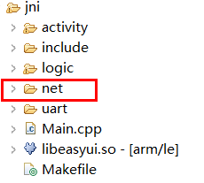
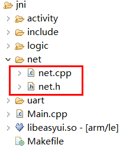

# socket网络编程
如果你熟悉Linux的socket编程，可以根据标准Linux socket编程接口进行网络编程。    

针对一些常用的socket编程实现操作，例如，建立TCP客户端，我们基于Linux 的标准接口做了简单的封装，方便使用。 如果需要，可以按步骤，将源码集成到自己的项目中。

## 移植步骤  
1. 在项目的jni文件夹下新建一个文件夹，命名为 `net`  
    
  
2. 下载 [net.h](https://docs.flythings.cn/src/net/net.h) 、[net.cpp](https://docs.flythings.cn/src/net/net.cpp) 两个文件，保存到`net`文件夹下。  

    

## 如何使用 
### TCP客户端
* 引入头文件 
  ```c++
  #include "net/net.h"
  ```
* 使用例子 
  ```c++
  //以tcp协议连接 www.baidu.com这个域名的80端口，域名改为IP也行
  net::Conn* conn = net::Dial("tcp", "www.baidu.com:80");
  //net::Conn* conn = net::Dial("tcp", "14.215.177.38:80");
  if (conn) {
    byte buf[2048] = {0};
    const char* req = "GET / HTTP/1.1\r\nConnection: close\r\n\r\n";
    //发送
    conn->Write((byte*)req, strlen(req));
    while (true) {
      //读取，超时1000毫秒
      int n = conn->Read(buf, sizeof(buf) - 1, 1000);
      if (n > 0) {
        buf[n] = 0;
        LOGD("读取 %d字节： %s", n, buf);
      } else if (n == 0) {
        LOGD("连接正常断开");
        break;
      } else if (n == net::E_TIMEOUT) {
        LOGD("读取超时");
      } else {
        LOGD("出错");
        break;
      }
    }
    //关闭连接
    conn->Close();
    //释放内存
    delete conn;
    conn = NULL;
  ```

### UDP客户端
* 引入头文件 
  ```c++
  #include "net/net.h"
  ```
* 使用例子
  ```c++
  //使用以udp协议连接IP:192.168.1.100 的8080端口
  net::Conn* conn = net::Dial("udp", "192.168.1.100:8080");
  if (conn) {
    byte buf[2048] = {0};
    const char* req = "hello";
    conn->Write((byte*)req, strlen(req));
    while (true) {
      //读取，超时1000毫秒
      int n = conn->Read(buf, sizeof(buf) - 1, 1000);
      if (n > 0) {
        buf[n] = 0;
        LOGD("读取 %d字节： %s", n, buf);
      } else if (n == 0) {
        LOGD("连接正常断开");
        break;
      } else if (n == net::E_TIMEOUT) {
        LOGD("读取超时");
        //这里设置超时就退出
        break;
      } else {
        LOGD("出错");
        break;
      }
    }
    //关闭连接
    conn->Close();
    //释放内存
    delete conn;
    conn = NULL;
  }
  ```

