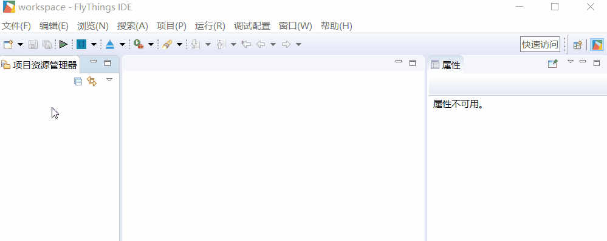
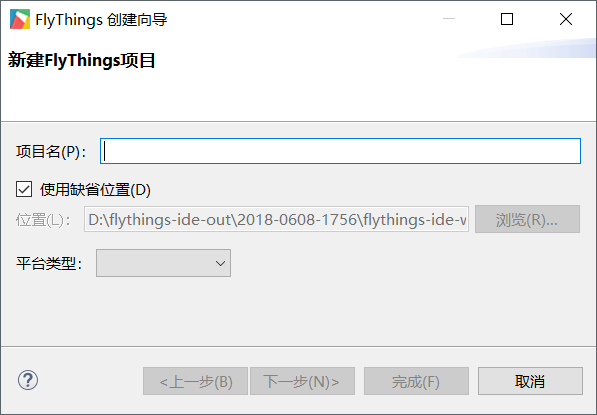

# How to create a new FlyThings project
Creating a new FlyThings project is very simple. Specific steps are as follows:  
1. In the menu bar at the top of the editor, select **File -> New -> FlyThings Project**  

     

2. After the selection in the previous step is completed, the **FlyThings Creation Wizard** prompt box will pop up. 
  
     
   Fill in the parameters related to the new project as required. These parameters are:  

   * **Item name**  
  The name of the project; it can be a combination of letters and numbers. Chinese characters and spaces cannot appear.  
   * **Position**  
  The storage path of the project; Chinese characters in the path are also not recommended to prevent compilation exceptions. 
   * **Platform type**  
  Choose the corresponding platform according to the serial screen you purchased, currently there are
     - **Z11S**  
     - **Z6S**  
    
   After filling in the required parameters as above, you can directly select **Complete** to quickly complete the creation. But for now, we choose **Next** to customize more parameters.
3. After clicking Next, we will see more parameter definitions  
  
     
   
   ## The meaning and function of each attribute of the project:  
   * **Screen saver timeout**  
   FlyThings system provides screensaver function. If there is no touch operation on the serial port screen within the specified time, or you do not reset the screen saver timing through the code, then the system will automatically enter the screen saver.  
  If the time is **-1** second, it means that the screen saver function is disabled.
   * **Serial port**  
  Specify the communication serial port, and generally do not need to be modified.
   * **Baud rate**   
  Specify the baud rate of the communication serial port 
   * **Resolution**  
  Specify the width and height of the screen in pixels
   * **Screen rotation**  
  For some screen coordinate axis directions, you can check this option to rotate the displayed content by 90° to achieve normal display.
   * **Font**  
  FlyThings supports custom fonts. If you are not satisfied with the default fonts, you can cancel the defaults and select your font file.
   * **Input**  
  If you have a requirement for Chinese input, you can check it and cooperate with **[Edit input box](edittext.md)** control, you can solve Chinese input.     
  
    The above attributes can be modified again later, so don't worry too much about filling in errors. ([How to modify the properties of an existing project](set_project_properties.md))  
  After the attributes are filled in and confirmed, click **Finish** to end the creation. The creation process will take some time and wait patiently.  
  
4. After the project is created, you should first understand [Introduction to FlyThings Project Code Structure](project_structure#project_structure.md)
