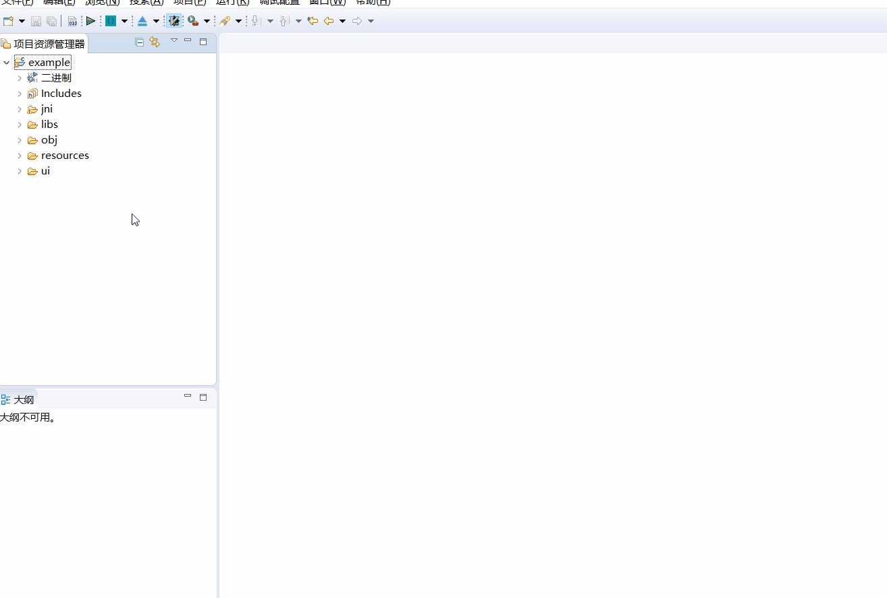
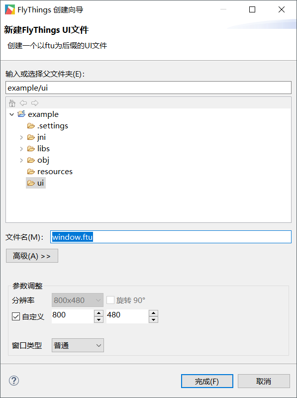

# How to create a new FlyThings UI file  
New UI file and [New FlyThings project](new_flythings_project.md#new_flythings_project) are similar.
1. In the Project Explorer, expand the project that needs to create the UI file, select the **ui** folder under the project, right-click, and in the pop-up menu, select the menu **New** -> **FlyThings UI file**.

     
2. After the above operations, a **New FlyThings UI File Wizard** box will pop up, as shown below:   

     
 (
   There are three parameters you want you to specify:  
   * **File name**   
  You need to specify the file name of the UI file. The file name is named with letters and numbers, with **ftu** (FlyThings UI File) as the suffix.
   * **Resolution**  
   You can control the width and height of the UI interface by adjusting the resolution, in pixels;  
   * **Window type**   
    There are currently four window types: **Normal**, **Status Bar**, **Navigation Bar**, and **Screensaver**.  
    In general, we can keep the **normal** option. For specific explanations of the other three types, 
    please refer to [System Application Introduction](system_app.md) 
    
 after confirming the parameters, select **Finish** to end the creation process. You can see the newly created UI file in the project's ui folder in the project explorer.

 
 
 
 
 
 
 
 
 
 
 
 
 
 
 