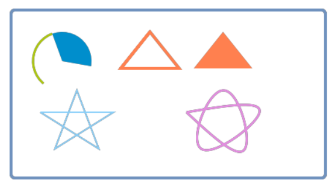

# Canvas

The canvas control provides a simple geometric drawing interface.
## How to use  
 Create a **canvas** control, the default canvas control is transparent. You can add a background image or modify the background color according to your needs.  

   

### Code manipulation  
Through the pointer of the **canvas** control, you can call the interface to draw graphics.
Almost all functions of this control require code implementation. The example is as follows.
```c++
static void onUI_init() {

    /**
     * Draw a rounded rectangle border
     */
    mPainter1Ptr->setLineWidth(4);
    mPainter1Ptr->setSourceColor(0x7092be);
    mPainter1Ptr->drawRect(10, 10, 430, 230, 5, 5);

    /**
     * Draw an arc
     */
    mPainter1Ptr->setLineWidth(3);
    mPainter1Ptr->setSourceColor(0xadc70c);
    mPainter1Ptr->drawArc(80, 80, 40, 40, -20, -120);

    /**
     * Draw a sector
     */
    mPainter1Ptr->setLineWidth(3);
    mPainter1Ptr->setSourceColor(0x008ecc);
    mPainter1Ptr->fillArc(80, 80, 40, 40, -20, 120);


    /**
     * Draw triangle
     */
    mPainter1Ptr->setLineWidth(4);
    mPainter1Ptr->setSourceColor(0xff804f);
    mPainter1Ptr->drawTriangle(200, 40, 160, 90, 240, 90);//Hollow triangle
    mPainter1Ptr->fillTriangle(300, 40, 260, 90, 340, 90); //Solid triangle

    /**
     * Draw a straight line
     */
    MPPOINT points1[] = {
            {50 , 150},
            {150, 150},
            {70 , 200},
            {100, 120},
            {130, 200},
            {50 , 150}
    };
    /** Connect to a line according to the provided coordinates of multiple points */
    mPainter1Ptr->setLineWidth(2);
    mPainter1Ptr->setSourceColor(0x88cffa);
    mPainter1Ptr->drawLines(points1, TABLESIZE(points1));


    /**
     * Draw a curve
     */
    MPPOINT points2[] = {
            {250, 150},
            {350, 150},
            {270, 200},
            {300, 120},
            {330, 200},
            {250, 150}
    };
    mPainter1Ptr->setLineWidth(3);
    mPainter1Ptr->setSourceColor(0xe28ddf);
    /** Connect as a curve according to the provided multiple point coordinates */
    mPainter1Ptr->drawCurve(points2, TABLESIZE(points2));
}
```
# Sample code
Demonstrates the use of the **canvas** control  

 

For the specific usage of the canvas control, please refer to the `PainterDemo` project in  [Sample Code](demo_download.md#demo_download) 