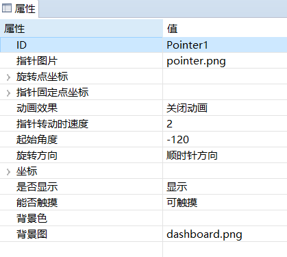
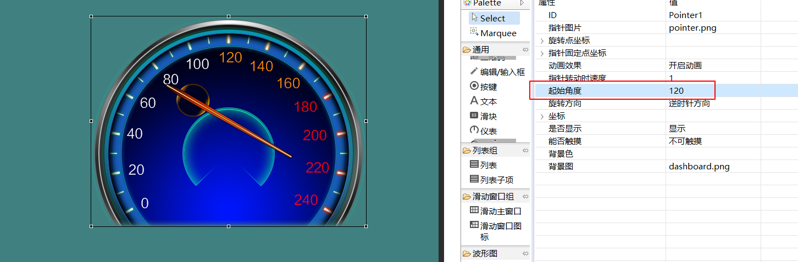
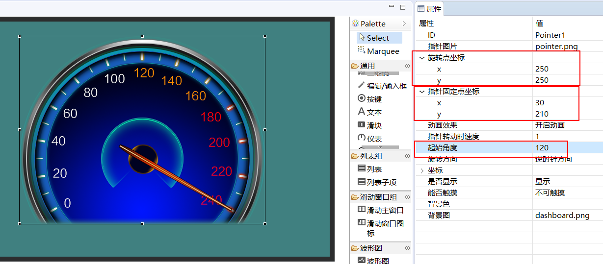
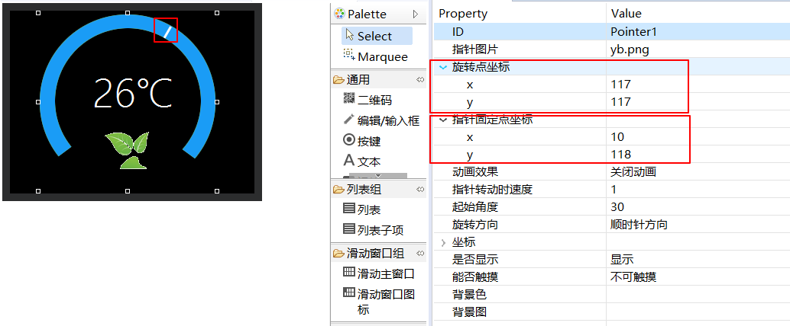

# 指针仪表控件
## 功能介绍
如果我们想要实现一个仪表，或者时钟转动类似的效果，用这个控件就可以轻松实现。这个控件就是专为处理图形旋转设计的。

## 思考
如果要实现一个仪表， 我们可以将它拆解为两个部分，分别为静止的背景图当作表盘和重叠在背景图上旋转的指针图片。  
所以，在选择好背景图和指针图片后，我们只需要确定指针旋转的圆心坐标即可。

## 具体如何使用  
1. 我们先创建一个 **仪表** 控件， 可以看到它具有如下的属性：   

   
 如果你还不知道如何创建一个控件，可以参考[如何创建按键控件](button.md#add_button)   
 属性图中，可以看到我已经添加了 **指针图片** 和 **背景图** 
 添加过程如动画所示：   
 
  
 
2. 从上面最后的预览图来看，并没有发现什么问题，背景图和指针的位置看起来都很正常。但是，程序真正运行起来后，是错误的。为了快速方便调整，我们可以将 **起始角度** 属性设置为其他度数（默认为0），这里我们调整为120，可以发现，指针旋转120°后，指针旋转的结果并不是我们期望的那样。   
   
 造成这种情况的原因是 **指针旋转的圆心坐标不正确**。  
 有两个属性共同决定指针旋转圆心坐标， 它们就是 **旋转点坐标** 和 **指针固定点坐标**  
 * 旋转点坐标  
  该坐标是参照整个控件矩形区域而言的，控件矩形区域左上角为[0,0],以像素为单位，对于这样的一个仪表而言，显然我们想要的旋转点坐标是在表盘的中央，那么对应图片的具体坐标是 （250，250），如下图：  
     
* 指针固定点坐标  
 该坐标是参照指针图片而言的，图片左上角为[0,0], 以像素为单位。  对于这样的指针图片而言，我们想要的指针固定点坐标是（30，210）  
   

将两个坐标分别填入属性表后，可以看到指针旋转到正确的位置   



**起始角度** 支持负数，在上面的例子中，如果 **将起始角度** 修改为-120，则指针刚好指向表盘0的位置。

## 关于指针固定点的技巧  
 在上面的例子中，指针固定点坐标位于指针图片内，其实，这个坐标还可以超出图片范围，达到游标的那种效果。 如下图，红色方框内的白色实际为一张指针图片，比较小，但是在右边的属性中，我将指针固定点坐标远远超出了图片的真实大小，再调整旋转坐标，就达到了圆环游标的效果。
 

## 操作方法  
这类控件最常用的方法就是通过代码调整指针的旋转角度。  
```c++
//将指针调整到90度
mPointer1Ptr->setTargetAngle(90.0);
```


# 样例代码
具体仪表控件的使用，参考[样例代码](demo_download.md#demo_download)中的PointerDemo项目。