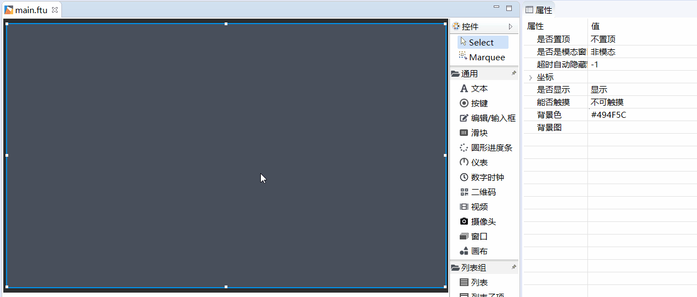

# QR code
## How to add a QR code?
If you need to display a two-dimensional code, you can quickly implement it using the existing `two-dimensional code` control. The specific steps are as follows:
1. Double click to open the UI file
2. Find the `QR code` control in the control set on the right
3. Left-click the `QR code` control and hold it, then drag it to any position, release the left button, and you can see the control of the automatic QR code.
4. Select the QR code control just generated, and in the property bar on the right side of the editor, you can modify the content of the QR code, and you can see that the QR code image will change simultaneously.

   

## Dynamically update the QR code
In addition to setting the QR code content through the tool, we can also dynamically set the QR code content through the code:
```c++
bool loadQRCode(const char *pStr);
```
# Sample code
Effect picture   

   

For the specific use of the QR code control, please refer to the QrCodeDemo project in [Sample Code](demo_download.md#demo_download)